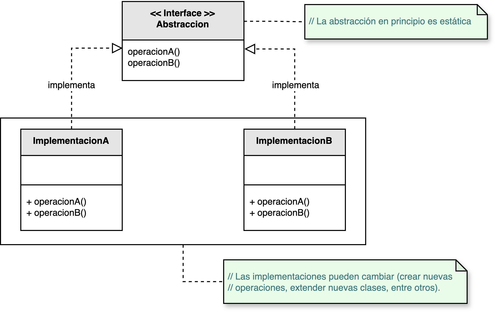
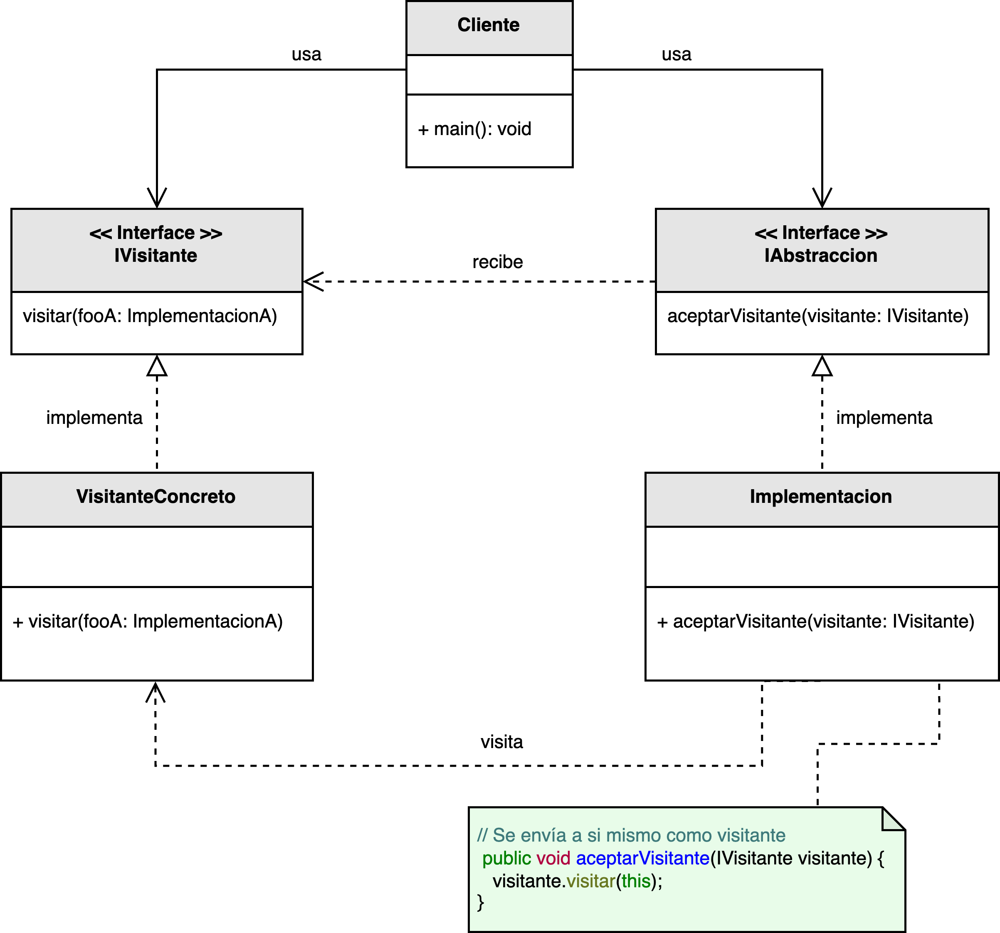

<h1 style="text-align:center;">
  <strong>🧠 Patrón Visitor (Visitante)</strong>
</h1>

<h4 style="text-align:center;"><em>“Permite definir nuevas operaciones sobre una jerarquía de clases sin modificar las
clases sobre las que opera.”</em></h4>

<p style="text-align:justify;">
El <b>patrón Visitor</b> pertenece al grupo de <b>patrones de comportamiento</b> y tiene como objetivo separar las operaciones de los objetos sobre los que actúan.  
De esta forma, es posible añadir nuevas operaciones sin alterar la estructura de las clases existentes, cumpliendo el <b>principio abierto/cerrado</b> y favoreciendo la <b>extensibilidad</b> del sistema.
</p>

<hr/>

<h2><strong>🧭 Motivación</strong></h2>

<p style="text-align:justify;">
El patrón <b>Visitor</b> es especialmente útil cuando se tiene una jerarquía de clases estable, pero se desea agregar nuevos comportamientos de forma frecuente.  
Modificando las clases base cada vez que se incorpora una nueva operación se rompería el principio de <b>abierto/cerrado</b> y podría comprometer la integridad del sistema.
</p>

<p style="text-align:justify;">
El <b>Visitor</b> propone una solución basada en la <b>doble indirección</b>:  
cada objeto de la jerarquía “acepta” un visitante (a través de un método <code>aceptarVisitante()</code>), y el visitante, a su vez, define el comportamiento que se debe ejecutar para ese tipo de objeto.  
De este modo, las clases del modelo permanecen estables, mientras que los visitantes encapsulan las operaciones que pueden cambiar con el tiempo.
</p>

<p style="text-align:center;">
  
</p>

<p style="text-align:justify;">
Si la abstracción cambia con frecuencia y las subclases son estables, el patrón <b>Visitor</b> permite extender la funcionalidad sin alterar las implementaciones originales.  
Esto resulta especialmente útil en sistemas con jerarquías grandes o estructuras complejas, como árboles sintácticos, modelos gráficos o sistemas de reporte.
</p>

<hr/>

<h2><strong>🧩 Estructura del patrón</strong></h2>

<p style="text-align:justify;">
La interfaz <b>IVisitante</b> define las operaciones que se pueden realizar sobre los distintos elementos del sistema.  
Cada clase concreta de la jerarquía (<b>IAbstracción</b> o <b>Implementación</b>) implementa un método <code>aceptarVisitante()</code> que delega la operación al visitante correspondiente, pasándose a sí misma como argumento.
</p>

<p style="text-align:center;">
  
</p>
<p style="text-align:center;"><b>Figura 1.</b> Diagrama UML del patrón <i>Visitor</i>.</p>

<hr/>

<h2><strong>👥 Participantes</strong></h2>

<table>
  <thead>
    <tr>
      <th style="text-align:center;">Elemento</th>
      <th style="text-align:justify;">Descripción</th>
    </tr>
  </thead>
  <tbody>
    <tr>
      <td style="text-align:center;"><b>IAbstracción</b></td>
      <td style="text-align:justify;">Interfaz o clase base que define el método <code>aceptarVisitante()</code>, permitiendo a los visitantes operar sobre las instancias concretas.</td>
    </tr>
    <tr>
      <td style="text-align:center;"><b>Implementación</b></td>
      <td style="text-align:justify;">Clase concreta que implementa el método <code>aceptarVisitante()</code> y delega la ejecución del comportamiento al visitante recibido.</td>
    </tr>
    <tr>
      <td style="text-align:center;"><b>IVisitante</b></td>
      <td style="text-align:justify;">Interfaz que declara los métodos de visita para cada tipo de elemento que puede ser visitado.</td>
    </tr>
    <tr>
      <td style="text-align:center;"><b>VisitanteConcreto</b></td>
      <td style="text-align:justify;">Clase que implementa las operaciones específicas que se ejecutan sobre los distintos tipos de elementos de la jerarquía.</td>
    </tr>
  </tbody>
</table>

<hr/>

<h2><strong>⚙️ Implementación básica en Java</strong></h2>

```java
// Interfaz para los elementos que pueden aceptar un visitante
interface IElemento {
    void aceptar(IVisitante visitante);
}

// Implementaciones concretas
class Circulo implements IElemento {
    public void aceptar(IVisitante visitante) {
        visitante.visitar(this);
    }
}

class Cuadrado implements IElemento {
    public void aceptar(IVisitante visitante) {
        visitante.visitar(this);
    }
}

// Interfaz del visitante
interface IVisitante {
    void visitar(Circulo circulo);

    void visitar(Cuadrado cuadrado);
}

// Visitante concreto
class DibujarVisitante implements IVisitante {
    public void visitar(Circulo circulo) {
        System.out.println("Dibujando un círculo...");
    }

    public void visitar(Cuadrado cuadrado) {
        System.out.println("Dibujando un cuadrado...");
    }
}

// Otro visitante concreto
class CalcularAreaVisitante implements IVisitante {
    public void visitar(Circulo circulo) {
        System.out.println("Calculando área del círculo...");
    }

    public void visitar(Cuadrado cuadrado) {
        System.out.println("Calculando área del cuadrado...");
    }
}

// Cliente
public class Main {
    public static void main(String[] args) {
        IElemento[] elementos = {new Circulo(), new Cuadrado()};

        IVisitante dibujar = new DibujarVisitante();
        IVisitante calcular = new CalcularAreaVisitante();

        System.out.println("== Dibujando figuras ==");
        for (IElemento e : elementos) e.aceptar(dibujar);

        System.out.println("\n== Calculando áreas ==");
        for (IElemento e : elementos) e.aceptar(calcular);
    }
}
```

<hr/>

<h2><strong>🌟 Ventajas</strong></h2>

<ul style="text-align:justify;">
  <li><b>Extensibilidad:</b> permite agregar nuevas operaciones sin modificar las clases base, respetando el principio abierto/cerrado (OCP).</li>
  <li><b>Cohesión:</b> agrupa las operaciones relacionadas en clases visitantes separadas, facilitando el mantenimiento y la lectura del código.</li>
  <li><b>Flexibilidad:</b> permite ejecutar múltiples operaciones sobre estructuras complejas sin conocer los tipos concretos de los elementos.</li>
  <li><b>Compatibilidad con estructuras compuestas:</b> ideal para recorrer árboles, listas o estructuras jerárquicas complejas aplicando una lógica común.</li>
</ul>

<hr/>

<h2><strong>⚠️ Desventajas</strong></h2>

<ul style="text-align:justify;">
  <li><b>Violación del encapsulamiento:</b> el visitante necesita conocer detalles internos de los objetos, lo que puede exponer información innecesaria.</li>
  <li><b>Fragilidad ante nuevos tipos de elementos:</b> agregar una nueva clase en la jerarquía obliga a actualizar la interfaz del visitante y todas sus implementaciones.</li>
  <li><b>Complejidad conceptual:</b> el mecanismo de doble despacho puede ser difícil de entender y aplicar correctamente al principio.</li>
</ul>

<hr/>

<h2><strong>🧮 Escenarios de aplicación</strong></h2>

<table>
  <thead>
    <tr>
      <th style="text-align:center;">💼 Contexto</th>
      <th style="text-align:justify;">📘 Aplicación del patrón</th>
    </tr>
  </thead>
  <tbody>
    <tr>
      <td style="text-align:center;"><b>Estructuras de árboles</b></td>
      <td style="text-align:justify;">Permite aplicar operaciones (renderización, optimización, transformación) sobre árboles de sintaxis o jerarquías de objetos sin modificar sus clases.</td>
    </tr>
    <tr>
      <td style="text-align:center;"><b>Reportes y exportación</b></td>
      <td style="text-align:justify;">Facilita la generación de reportes en distintos formatos (PDF, CSV, JSON) utilizando visitantes específicos para cada formato.</td>
    </tr>
    <tr>
      <td style="text-align:center;"><b>Interfaces gráficas (GUI)</b></td>
      <td style="text-align:justify;">Aplica cambios globales en la interfaz, como temas o configuraciones visuales, recorriendo los elementos visuales de manera uniforme.</td>
    </tr>
    <tr>
      <td style="text-align:center;"><b>Análisis de código</b></td>
      <td style="text-align:justify;">Permite recorrer estructuras de código fuente (AST) para extraer métricas, aplicar refactorizaciones o realizar análisis estáticos.</td>
    </tr>
  </tbody>
</table>

<hr/>

<h2><strong>📎 Referencia</strong></h2>

<p style="text-align:justify;">
Este material corresponde al patrón <b>Visitor (Visitante)</b> descrito en el libro  
<i><b>Notas a mano sobre análisis orientado a objetos y patrones de diseño</b></i> (Orozco, 2025).
</p>