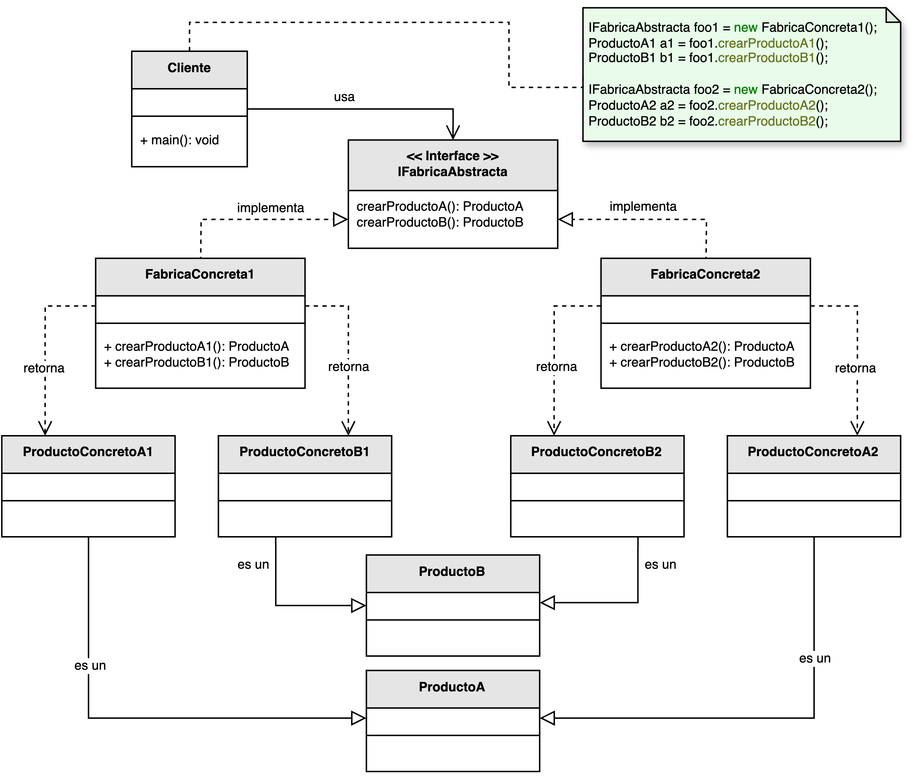

<h1 style="text-align:center;"><strong>🏭 Patrón Abstract Factory (Fábrica Abstracta)</strong></h1>

<h4 style="text-align:center;"><em>“Proporciona una interfaz para crear familias de objetos relacionados sin especificar
sus clases concretas.”</em></h4>

<p style="text-align:justify;">
El patrón <b>Abstract Factory</b> pertenece a la familia de los <b>patrones creacionales</b> y tiene como propósito <b>proveer una interfaz común</b> para la creación de familias de productos que comparten una estructura o propósito.  
De esta manera, el cliente puede solicitar la creación de objetos sin conocer las clases concretas, dependiendo solo de las fábricas abstractas que encapsulan la lógica de instanciación.
</p>

<hr/>

<h2><strong>🧭 Motivación</strong></h2>

<p style="text-align:justify;">
En muchos sistemas, los objetos no existen de forma aislada, sino como parte de <b>familias de productos relacionados</b>.  
Por ejemplo, una aplicación de interfaz gráfica puede tener distintos conjuntos de componentes (botones, menús, cuadros de texto) para cada sistema operativo o tema visual.  
El patrón <b>Abstract Factory</b> permite crear estos conjuntos de productos <b>de forma consistente</b> sin acoplar el código cliente a las implementaciones concretas, apoyándose en el <b>principio de inversión de dependencias</b>.
</p>

<hr/>

<h2><strong>🧩 Estructura del patrón</strong></h2>

<p style="text-align:justify;">
La interfaz <b>IFabricaAbstracta</b> define los métodos para crear distintos tipos de productos.  
Cada <b>FabricaConcreta</b> implementa esta interfaz y devuelve las instancias concretas de los productos pertenecientes a una misma familia.  
Así, el cliente puede trabajar únicamente con la fábrica abstracta sin conocer los detalles de cada clase concreta.
</p>

<p style="text-align:center;">
  
</p>
<p style="text-align:center;"><b>Figura 1.</b> Diagrama UML del patrón <i>Abstract Factory</i>.</p>

<hr/>

<h2><strong>👥 Participantes</strong></h2>

<table>
  <thead>
    <tr>
      <th style="text-align:center;">Elemento</th>
      <th style="text-align:justify;">Descripción</th>
    </tr>
  </thead>
  <tbody>
    <tr>
      <td style="text-align:center;"><b>IFabricaAbstracta</b></td>
      <td style="text-align:justify;">Declara un conjunto de métodos para crear productos abstractos pertenecientes a la misma familia.</td>
    </tr>
    <tr>
      <td style="text-align:center;"><b>FabricaConcreta</b></td>
      <td style="text-align:justify;">Implementa los métodos de la fábrica abstracta y crea productos específicos pertenecientes a una familia concreta.</td>
    </tr>
    <tr>
      <td style="text-align:center;"><b>ProductoAbstracto</b></td>
      <td style="text-align:justify;">Define la interfaz común para los objetos que conforman una familia de productos.</td>
    </tr>
    <tr>
      <td style="text-align:center;"><b>ProductoConcreto</b></td>
      <td style="text-align:justify;">Implementa el comportamiento específico de un producto perteneciente a una familia concreta.</td>
    </tr>
    <tr>
      <td style="text-align:center;"><b>Cliente</b></td>
      <td style="text-align:justify;">Utiliza únicamente las interfaces abstractas tanto de las fábricas como de los productos, manteniendo independencia de las implementaciones concretas.</td>
    </tr>
  </tbody>
</table>

<hr/>

<h2><strong>⚙️ Implementación básica en Java</strong></h2>

```java
// Productos abstractos
interface Boton {
    void pintar();
}

interface Checkbox {
    void seleccionar();
}

// Productos concretos - Familia Windows
class BotonWindows implements Boton {
    public void pintar() {
        System.out.println("Renderizando botón estilo Windows");
    }
}

class CheckboxWindows implements Checkbox {
    public void seleccionar() {
        System.out.println("Checkbox estilo Windows seleccionado");
    }
}

// Productos concretos - Familia Mac
class BotonMac implements Boton {
    public void pintar() {
        System.out.println("Renderizando botón estilo Mac");
    }
}

class CheckboxMac implements Checkbox {
    public void seleccionar() {
        System.out.println("Checkbox estilo Mac seleccionado");
    }
}

// Fábrica abstracta
interface FabricaGUI {
    Boton crearBoton();

    Checkbox crearCheckbox();
}

// Fábricas concretas
class FabricaWindows implements FabricaGUI {
    public Boton crearBoton() {
        return new BotonWindows();
    }

    public Checkbox crearCheckbox() {
        return new CheckboxWindows();
    }
}

class FabricaMac implements FabricaGUI {
    public Boton crearBoton() {
        return new BotonMac();
    }

    public Checkbox crearCheckbox() {
        return new CheckboxMac();
    }
}

// Cliente
public class Main {
    public static void main(String[] args) {
        FabricaGUI fabrica = new FabricaWindows(); // o new FabricaMac()
        Boton boton = fabrica.crearBoton();
        Checkbox check = fabrica.crearCheckbox();

        boton.pintar();
        check.seleccionar();
    }
}
```

<hr/>

<h2><strong>🌟 Ventajas</strong></h2>

<ul style="text-align:justify;">
  <li><b>Compatibilidad garantizada:</b> asegura que los productos de una misma familia trabajen correctamente entre sí.</li>
  <li><b>Desacoplamiento:</b> el cliente depende de abstracciones, no de implementaciones concretas.</li>
  <li><b>Intercambiabilidad:</b> cambiar de familia de productos requiere solo reemplazar la fábrica utilizada.</li>
  <li><b>Escalabilidad:</b> nuevas variantes de productos pueden añadirse creando nuevas fábricas concretas sin modificar el código cliente.</li>
</ul>

<hr/>

<h2><strong>⚠️ Desventajas</strong></h2>

<ul style="text-align:justify;">
  <li><b>Complejidad adicional:</b> introduce múltiples niveles de abstracción y más clases en el diseño.</li>
  <li><b>Dificultad para extender productos:</b> agregar un nuevo tipo de producto puede requerir modificar todas las fábricas existentes, violando el principio abierto/cerrado.</li>
  <li><b>Inicialización más compleja:</b> puede requerir la configuración explícita de la fábrica apropiada antes de usar el sistema.</li>
</ul>

<hr/>

<h2><strong>🧮 Escenarios de aplicación</strong></h2>

<table>
  <thead>
    <tr>
      <th style="text-align:center;">💼 Contexto</th>
      <th style="text-align:justify;">📘 Aplicación del patrón</th>
    </tr>
  </thead>
  <tbody>
    <tr>
      <td style="text-align:center;"><b>Interfaz multiplataforma</b></td>
      <td style="text-align:justify;">Permite crear componentes gráficos (botones, menús, cuadros de diálogo) que se adaptan al sistema operativo sin cambiar el código cliente.</td>
    </tr>
    <tr>
      <td style="text-align:center;"><b>Temas o estilos visuales</b></td>
      <td style="text-align:justify;">Facilita alternar entre distintos temas de interfaz (oscuro, claro, corporativo) sin modificar la lógica del programa.</td>
    </tr>
    <tr>
      <td style="text-align:center;"><b>Localización regional</b></td>
      <td style="text-align:justify;">Permite crear familias de productos adaptados a idiomas, monedas o convenciones locales sin duplicar código.</td>
    </tr>
    <tr>
      <td style="text-align:center;"><b>Pruebas unitarias y simulaciones</b></td>
      <td style="text-align:justify;">Facilita la creación de mocks y stubs que reemplazan implementaciones reales durante pruebas.</td>
    </tr>
  </tbody>
</table>

<hr/>

<h2><strong>📎 Referencia</strong></h2>

<p style="text-align: justify;">
Este material corresponde al patrón <b>Abstract Factory (Fábrica Abstracta)</b> descrito en el libro  
<i><b>Notas a mano sobre análisis orientado a objetos y patrones de diseño</b></i> (Orozco, 2025).
</p>