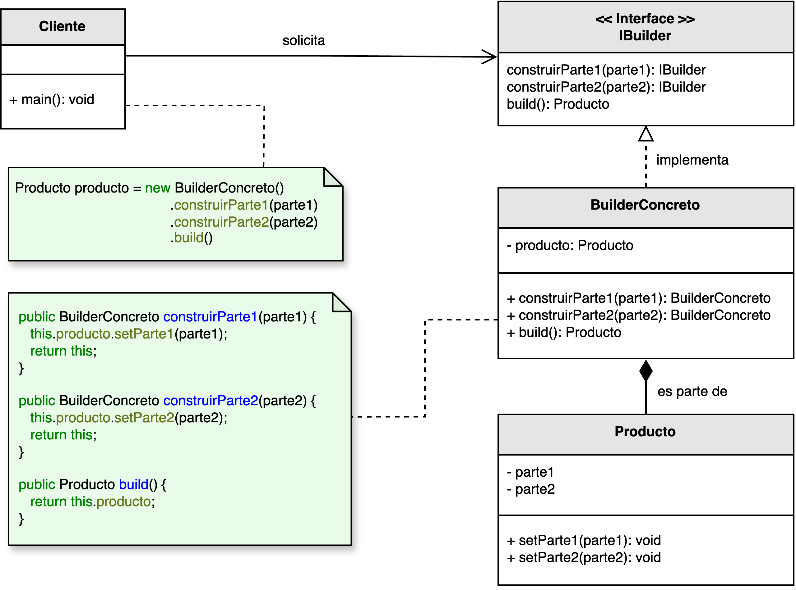
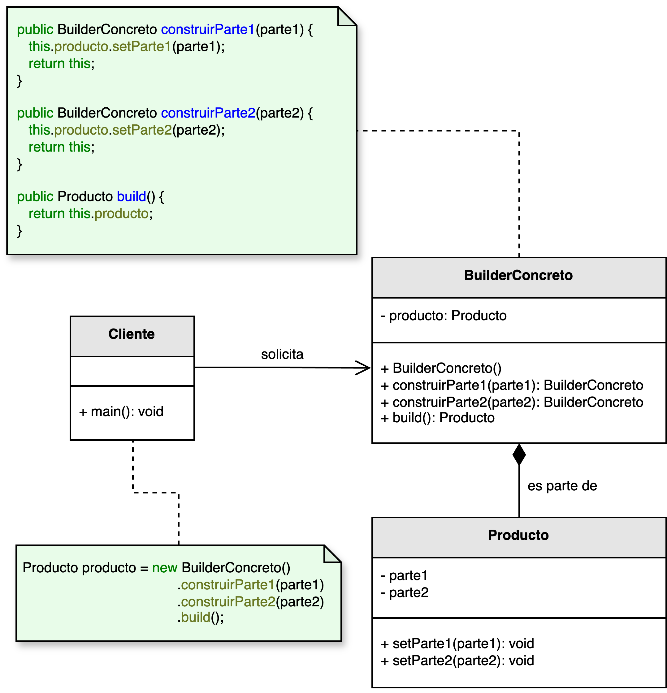
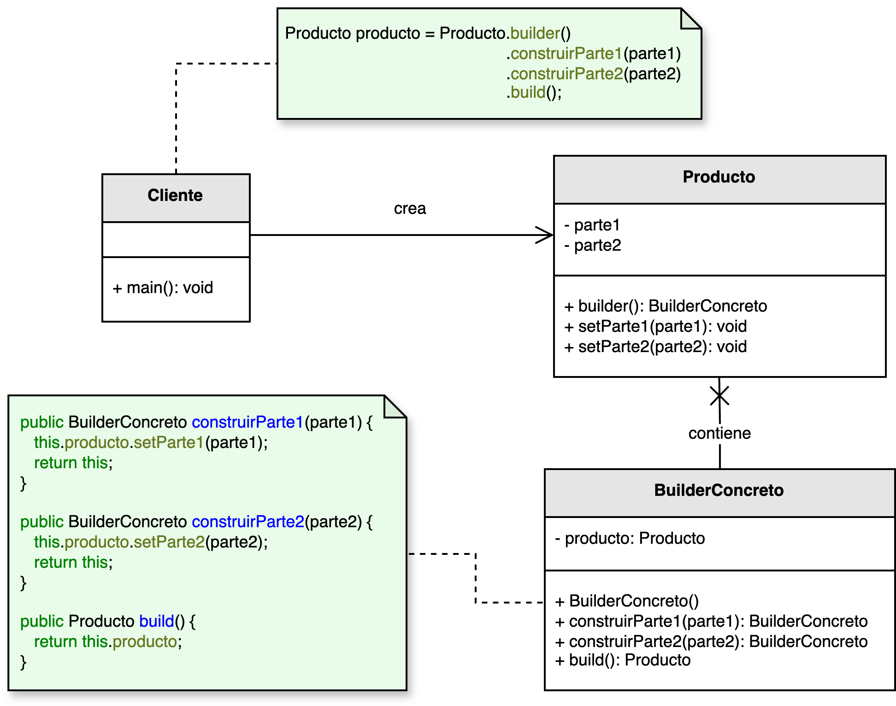

<h1 style="text-align:center;"><strong>🏗️ Patrón Builder (Constructor)</strong></h1>

<h4 style="text-align:center;"><em>“Separa la construcción de un objeto complejo de su representación, permitiendo crear variantes paso a paso.”</em></h4>

<p style="text-align: justify;">
El <b>patrón Builder</b> es un patrón <b>creacional</b> que facilita la construcción de <b>objetos complejos</b> mediante un intermediario (<i>builder</i>) que asigna valores a sus atributos de forma <b>fluida y dinámica</b>.  
Su objetivo es evitar constructores con muchas combinaciones de parámetros y mejorar la <b>legibilidad</b>, <b>modularidad</b> y <b>mantenibilidad</b> del código.
</p>

<hr/>

<h2><strong>🧭 Motivación</strong></h2>
<p style="text-align: justify;">
Cuando un objeto admite múltiples combinaciones de atributos (muchos parámetros opcionales, validaciones o pasos de armado), los constructores tradicionales se vuelven difíciles de usar y mantener (<i>telescoping constructors</i>).  
El patrón <b>Builder</b> propone <b>construir el objeto en etapas</b>, encapsulando la lógica de armado y exponiendo una <b>API fluida</b> que guía al cliente, reduciendo errores y mejorando la claridad del código.
</p>

<hr/>

<h2><strong>🧩 Estructuras UML frecuentes</strong></h2>

<ul>
  <li>
    <p style="text-align: justify;"><b>Builder explícito usando interfaz:</b> La interfaz <b>IBuilder</b> declara las operaciones de construcción. <b>BuilderConcreto</b> implementa los pasos y <b>Producto</b> es el resultado final solicitado por el cliente.</p>
    <p style="text-align:center;">
      
    </p>
    <p style="text-align:center;"><b>Figura 1.</b> Builder explícito con interfaz.</p>
  </li>

  <li>
    <p style="text-align: justify;"><b>Builder explícito directo:</b> El cliente interactúa con un <b>Builder</b> concreto sin abstracción previa. Aumenta el acoplamiento con el producto, pero simplifica el diagrama cuando solo hay una representación.</p>
    <p style="text-align:center;">
      
    </p>
    <p style="text-align:center;"><b>Figura 2.</b> Builder explícito directo.</p>
  </li>

  <li>
    <p style="text-align: justify;"><b>Builder implícito (anidado):</b> El <b>Builder</b> es una clase estática anidada dentro del <b>Producto</b>. Es el estilo más común en Java moderno y bibliotecas fluent.</p>
    <p style="text-align:center;">
      
    </p>
    <p style="text-align:center;"><b>Figura 3.</b> Builder implícito (anidado en el producto).</p>
  </li>
</ul>

<hr/>

<h2><strong>👥 Participantes</strong></h2>
<table>
  <thead>
    <tr>
      <th style="text-align:center;">Elemento</th>
      <th style="text-align:justify;">Descripción</th>
    </tr>
  </thead>
  <tbody>
    <tr>
      <td style="text-align:center;"><b>Producto</b></td>
      <td style="text-align:justify;">Objeto complejo que se desea construir. Puede requerir múltiples pasos, validaciones y combinaciones de atributos.</td>
    </tr>
    <tr>
      <td style="text-align:center;"><b>IBuilder</b></td>
      <td style="text-align:justify;">Contrato que define las operaciones de construcción y el método <code>build()</code> para obtener el producto final.</td>
    </tr>
    <tr>
      <td style="text-align:center;"><b>BuilderConcreto</b></td>
      <td style="text-align:justify;">Implementa los pasos de armado y devuelve <b>this</b> para permitir una API fluida. <code>build()</code> retorna el <b>Producto</b>.</td>
    </tr>
    <tr>
      <td style="text-align:center;"><b>Director</b> (opcional)</td>
      <td style="text-align:justify;">Orquesta la secuencia de construcción cuando se requieren recetas fijas.</td>
    </tr>
    <tr>
      <td style="text-align:center;"><b>Cliente</b></td>
      <td style="text-align:justify;">Configura el Builder y solicita el producto final.</td>
    </tr>
  </tbody>
</table>

<hr/>

<h2><strong>⚙️ Implementación básica en Java (Builder implícito anidado)</strong></h2>
```java
public class Reporte {
    private final String titulo;
    private final String autor;
    private final int paginas;
    private final boolean publico;

    private Reporte(Builder b) {
        this.titulo  = b.titulo;
        this.autor   = b.autor;
        this.paginas = b.paginas;
        this.publico = b.publico;
    }

    public static class Builder {
        private String titulo;
        private String autor;
        private int paginas;
        private boolean publico;

        public Builder conTitulo(String v)   { this.titulo = v;  return this; }
        public Builder conAutor(String v)    { this.autor = v;   return this; }
        public Builder conPaginas(int v)     { this.paginas = v; return this; }
        public Builder esPublico(boolean v)  { this.publico = v; return this; }

        public Reporte build() {
            // Validaciones de negocio previas a construir:
            if (titulo == null || titulo.isBlank())
                throw new IllegalStateException("El título es obligatorio");
            return new Reporte(this);
        }
    }

    @Override public String toString() {
        return "Reporte{" + "titulo='" + titulo + '\'' +
               ", autor='" + autor + '\'' +
               ", paginas=" + paginas +
               ", publico=" + publico + '}';
    }

    // Ejemplo de uso:
    public static void main(String[] args) {
        Reporte r = new Reporte.Builder()
                .conTitulo("Informe trimestral")
                .conAutor("C. Orozco")
                .conPaginas(42)
                .esPublico(true)
                .build();
        System.out.println(r);
    }
}
```

<hr/>

<h2><strong>🌟 Ventajas</strong></h2>
<ul style="text-align: justify;">
  <li><b>Legibilidad:</b> evita constructores telescópicos y hace explícitas las opciones de configuración.</li>
  <li><b>Flexibilidad:</b> permite construir el objeto en varias etapas y con orden libre cuando aplica.</li>
  <li><b>Validaciones centralizadas:</b> concentra reglas de negocio previas a <code>build()</code>.</li>
  <li><b>Independencia de representaciones:</b> el mismo proceso puede generar variantes del producto.</li>
</ul>

<h2><strong>⚠️ Desventajas</strong></h2>
<ul style="text-align: justify;">
  <li>Añade clases adicionales (builders, director) y puede ser excesivo para objetos simples.</li>
  <li>Si existen muchas familias de productos, puede proliferar el número de builders.</li>
  <li>Riesgo de objetos <i>parcialmente construidos</i> si no se aplican validaciones adecuadas antes de <code>build()</code>.</li>
</ul>

<hr/>

<h2><strong>🧮 Escenarios de aplicación</strong></h2>
<table>
  <thead>
    <tr>
      <th style="text-align:center;">💼 Contexto</th>
      <th style="text-align:justify;">📘 Aplicación del patrón</th>
    </tr>
  </thead>
  <tbody>
    <tr>
      <td style="text-align:center;"><b>Objetos con muchos opcionales</b></td>
      <td style="text-align:justify;">Configuración clara y gradual cuando existen numerosos parámetros opcionales o reglas de validación.</td>
    </tr>
    <tr>
      <td style="text-align:center;"><b>Documentos/consultas</b></td>
      <td style="text-align:justify;">Construcción paso a paso de HTML, PDF, consultas SQL, etc.</td>
    </tr>
    <tr>
      <td style="text-align:center;"><b>Pipelines de datos</b></td>
      <td style="text-align:justify;">Encadena transformaciones configurables antes de materializar el resultado.</td>
    </tr>
    <tr>
      <td style="text-align:center;"><b>Director con recetas</b></td>
      <td style="text-align:justify;">Cuando se necesitan “recetas” repetibles para construir variantes de un producto.</td>
    </tr>
  </tbody>
</table>

<hr/>

<h2><strong>📎 Notas</strong></h2>
<ul style="text-align: justify;">
  <li>Las figuras provienen de <code>resources/images/creacional/</code>: <i>builder_abstracto.png</i>, <i>builder_concreto.png</i> y <i>builder_implicito.png</i>.</li>
  <li>En Java moderno, el <b>builder anidado</b> es el estilo más difundido por su encapsulamiento y ergonomía.</li>
</ul>

<p style="text-align: justify;">
Este material corresponde al patrón <b>Builder (Constructor)</b> descrito en el libro  
<i><b>Notas a mano sobre análisis orientado a objetos y patrones de diseño</b></i> (Orozco, 2025).
</p>