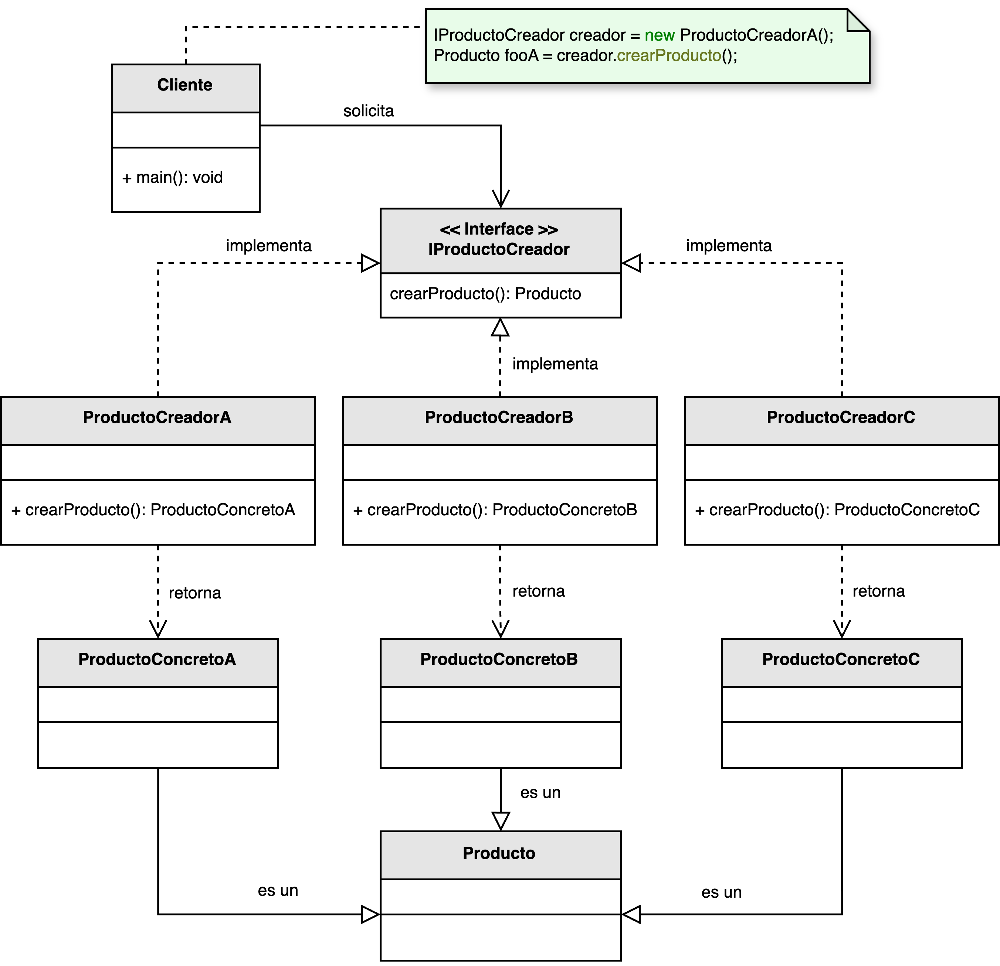

<h1 style="text-align:center;"><strong>🏭 Patrón Factory (Fábrica)</strong></h1>

<h4 style="text-align:center;"><em>“Define una interfaz para crear objetos sin especificar su clase concreta.”</em></h4>

<p style="text-align: justify;">
El <b>patrón Factory</b> pertenece a la familia de los <b>patrones creacionales</b> y su propósito es <b>centralizar la lógica de creación de objetos</b> pertenecientes a una jerarquía de clases,  
sin que el cliente deba conocer la clase concreta que está instanciando.  
Este enfoque favorece el <b>principio de inversión de dependencias</b> al desacoplar el código que crea los objetos del que los utiliza.
</p>

<hr/>

<h2><strong>🧭 Motivación</strong></h2>

<p style="text-align: justify;">
En los lenguajes orientados a objetos, la creación de instancias mediante <code>new</code> suele implicar un conocimiento directo de la clase concreta.  
Esto genera un acoplamiento rígido entre el cliente y las implementaciones, dificultando la extensibilidad.  
El patrón Factory resuelve este problema delegando la responsabilidad de instanciación a una clase especializada —la <b>fábrica</b>— que decide qué subclase concreta se debe crear según las condiciones de ejecución.
</p>

<p style="text-align: justify;">
De esta manera, el cliente interactúa únicamente con una <b>interfaz o clase abstracta</b>,  
sin preocuparse por los detalles de construcción del objeto, lo que hace que el sistema sea más flexible y fácil de mantener.
</p>

<hr/>

<h2><strong>🧩 Estructura del patrón</strong></h2>

<p style="text-align: justify;">
El cliente solicita un <b>ProductoConcreto</b> a través de la interfaz <b>IProductoCreador</b>,  
la cual delega la creación a una clase <b>ProductoCreador</b> concreta.  
Esto permite que la fábrica decida cuál instancia específica devolver sin exponer los detalles al cliente.
</p>

<p style="text-align:center;">
  
</p>
<p style="text-align:center;"><b>Figura 1.</b> Diagrama UML del patrón <i>Factory</i>.</p>

<hr/>

<h2><strong>👥 Participantes</strong></h2>

<table>
  <thead>
    <tr>
      <th style="text-align:center;">Elemento</th>
      <th style="text-align:justify;">Descripción</th>
    </tr>
  </thead>
  <tbody>
    <tr>
      <td style="text-align:center;"><b>Producto</b></td>
      <td style="text-align:justify;">Interfaz o clase abstracta que define las operaciones comunes a todos los productos que la fábrica puede crear.</td>
    </tr>
    <tr>
      <td style="text-align:center;"><b>ProductoConcreto</b></td>
      <td style="text-align:justify;">Implementación específica de <i>Producto</i> que define el comportamiento particular del objeto instanciado.</td>
    </tr>
    <tr>
      <td style="text-align:center;"><b>IProductoCreador</b></td>
      <td style="text-align:justify;">Contrato que declara el método de creación que debe implementar la fábrica concreta.</td>
    </tr>
    <tr>
      <td style="text-align:center;"><b>ProductoCreador</b></td>
      <td style="text-align:justify;">Clase que implementa la interfaz y define la lógica que decide qué producto concreto se debe crear.</td>
    </tr>
  </tbody>
</table>

<hr/>

<h2><strong>⚙️ Implementación básica en Java</strong></h2>

```java
// Interfaz común para los productos
interface Producto {
    void mostrar();
}

// Productos concretos
class ProductoA implements Producto {
    public void mostrar() {
        System.out.println("Soy el producto tipo A");
    }
}

class ProductoB implements Producto {
    public void mostrar() {
        System.out.println("Soy el producto tipo B");
    }
}

// Interfaz para el creador
interface Fabrica {
    Producto crearProducto(String tipo);
}

// Fábrica concreta
class FabricaConcreta implements Fabrica {
    public Producto crearProducto(String tipo) {
        if (tipo.equalsIgnoreCase("A")) return new ProductoA();
        else if (tipo.equalsIgnoreCase("B")) return new ProductoB();
        throw new IllegalArgumentException("Tipo de producto no reconocido");
    }
}

// Uso del patrón
public class Main {
    public static void main(String[] args) {
        Fabrica fabrica = new FabricaConcreta();
        Producto producto = fabrica.crearProducto("A");
        producto.mostrar();
    }
}
```

<hr/>

<h2><strong>🌟 Ventajas</strong></h2>

<ul style="text-align: justify;">
  <li><b>Extensibilidad:</b> Permite agregar nuevos tipos de productos sin modificar el código existente del cliente.</li>
  <li><b>Desacoplamiento:</b> El cliente desconoce la clase concreta del producto, operando solo con su interfaz o clase base.</li>
  <li><b>Uniformidad:</b> Garantiza que todos los objetos de un tipo sean creados de forma consistente y controlada.</li>
  <li><b>Centralización:</b> La lógica de creación se agrupa en un único punto, lo que facilita el mantenimiento y la configuración.</li>
</ul>

<hr/>

<h2><strong>⚠️ Desventajas</strong></h2>

<ul style="text-align: justify;">
  <li><b>Complejidad adicional:</b> Introduce una capa intermedia que puede ser innecesaria si los tipos de objetos son pocos o no cambian.</li>
  <li><b>Configuración más compleja:</b> Puede requerir que el cliente conozca las opciones válidas para inicializar la fábrica.</li>
  <li><b>Sobreabstracción:</b> Un uso excesivo puede volver el diseño más difícil de entender y mantener.</li>
</ul>

<hr/>

<h2><strong>🧮 Escenarios de aplicación</strong></h2>

<table>
  <thead>
    <tr>
      <th style="text-align:center;">💼 Contexto</th>
      <th style="text-align:justify;">📘 Aplicación del patrón</th>
    </tr>
  </thead>
  <tbody>
    <tr>
      <td style="text-align:center;"><b>Creación de componentes UI</b></td>
      <td style="text-align:justify;">Permite generar elementos de interfaz que cambian según el sistema operativo o el tema visual del usuario.</td>
    </tr>
    <tr>
      <td style="text-align:center;"><b>Manejo de recursos en videojuegos</b></td>
      <td style="text-align:justify;">Crea distintos tipos de enemigos, escenarios o ítems sin modificar la lógica del juego principal.</td>
    </tr>
    <tr>
      <td style="text-align:center;"><b>Arquitecturas extensibles</b></td>
      <td style="text-align:justify;">Facilita la incorporación de nuevos tipos de datos o comportamientos mediante módulos o plugins externos.</td>
    </tr>
    <tr>
      <td style="text-align:center;"><b>Procesamiento de documentos</b></td>
      <td style="text-align:justify;">Genera instancias de diferentes tipos de documentos (PDF, Word, Excel) a partir de un tipo genérico de producto.</td>
    </tr>
  </tbody>
</table>

<hr/>

<h2><strong>📎 Referencia</strong></h2>

<p style="text-align: justify;">
Este material corresponde al patrón <b>Factory (Fábrica)</b> descrito en el libro  
<i><b>Notas a mano sobre análisis orientado a objetos y patrones de diseño</b></i> (Orozco, 2025).
</p>