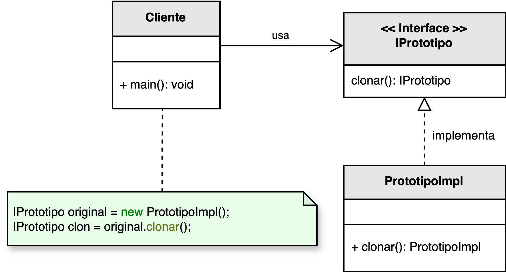

<h1 style="text-align:center;"><strong>🧬 Patrón Prototype (Prototipo)</strong></h1>

<h4 style="text-align:center;"><em>“Crea nuevos objetos clonando instancias existentes en lugar de construirlas desde
cero.”</em></h4>

<p style="text-align: justify;">
El <b>patrón Prototype</b> pertenece a la familia de los <b>patrones creacionales</b> y su propósito es <b>clonar instancias</b> de una clase mediante el uso de un objeto existente como plantilla.  
El nuevo objeto resultante conserva la estructura del prototipo original, permitiendo modificaciones puntuales sin necesidad de conocer los detalles internos de su creación.
</p>

<hr/>

<h2><strong>🧭 Motivación</strong></h2>

<p style="text-align: justify;">
En ciertos contextos, crear objetos desde cero puede ser un proceso costoso —ya sea por inicializaciones complejas, carga de recursos o configuraciones específicas—.  
En estos casos, el patrón Prototype permite duplicar una instancia preexistente y adaptar sus propiedades según las necesidades.  
Esta estrategia es especialmente útil cuando los <b>tipos de objetos a instanciar se determinan dinámicamente</b> o cuando las clases concretas son desconocidas.
</p>

<hr/>

<h2><strong>🧩 Estructura del patrón</strong></h2>

<p style="text-align: justify;">
La interfaz <b>IPrototipo</b> define el contrato que permite clonar objetos, mientras que las clases concretas implementan la lógica necesaria para realizar copias completas o parciales.  
La siguiente figura ilustra el modelo UML del patrón:
</p>

<p style="text-align:center;">
  
</p>
<p style="text-align:center;"><b>Figura 1.</b> Diagrama UML del patrón <i>Prototype</i>.</p>

<p style="text-align: justify;">
Existen dos enfoques comunes para la clonación:
</p>

<ul style="text-align: justify;">
  <li><b>Clonación superficial:</b> Copia los valores de los tipos primitivos, pero las referencias a objetos apuntan al mismo espacio de memoria.  
  Cualquier modificación sobre el objeto clonado afecta al original.</li>
  <li><b>Clonación profunda:</b> Duplica todos los atributos, incluidos los objetos referenciados, generando una copia totalmente independiente.  
  Implica un mayor costo computacional, pero elimina los efectos colaterales.</li>
</ul>

<hr/>

<h2><strong>👥 Participantes</strong></h2>

<table>
  <thead>
    <tr>
      <th style="text-align:center;">Elemento</th>
      <th style="text-align:justify;">Descripción</th>
    </tr>
  </thead>
  <tbody>
    <tr>
      <td style="text-align:center;"><b>IPrototipo</b></td>
      <td style="text-align:justify;">Define la operación <code>clonar()</code> que permite crear copias de los objetos.</td>
    </tr>
    <tr>
      <td style="text-align:center;"><b>PrototipoConcreto</b></td>
      <td style="text-align:justify;">Implementa la interfaz y define la lógica necesaria para realizar la clonación profunda o superficial del objeto.</td>
    </tr>
  </tbody>
</table>

<hr/>

<h2><strong>⚙️ Implementación básica en Java</strong></h2>

```java
// Interfaz prototipo
public interface IPrototipo extends Cloneable {
    IPrototipo clonar();
}

// Clase concreta
public class Documento implements IPrototipo {
    private String titulo;
    private String contenido;

    public Documento(String titulo, String contenido) {
        this.titulo = titulo;
        this.contenido = contenido;
    }

    @Override
    public IPrototipo clonar() {
        try {
            return (IPrototipo) super.clone(); // Clonación superficial
        } catch (CloneNotSupportedException e) {
            throw new RuntimeException("Error al clonar el objeto", e);
        }
    }

    public void mostrar() {
        System.out.println("Título: " + titulo + " | Contenido: " + contenido);
    }
}

// Ejemplo de uso
public class Main {
    public static void main(String[] args) {
        Documento original = new Documento("Informe", "Versión 1.0");
        Documento copia = (Documento) original.clonar();

        copia.mostrar();
    }
}
```

<hr/>

<h2><strong>🌟 Ventajas</strong></h2>

<ul style="text-align: justify;">
  <li>Permite crear nuevos objetos <b>rápidamente</b> sin depender del constructor o de inicializaciones complejas.</li>
  <li>Reduce el <b>acoplamiento</b> entre clases, ya que los clientes pueden crear copias sin conocer los detalles internos de cada tipo.</li>
  <li>Facilita la <b>configuración dinámica</b> de instancias predefinidas que sirven como modelos o plantillas.</li>
  <li>Evita la creación repetitiva de estructuras comunes, promoviendo la reutilización de configuraciones.</li>
</ul>

<hr/>

<h2><strong>⚠️ Desventajas</strong></h2>

<ul style="text-align: justify;">
  <li>La clonación profunda puede ser <b>costosa y propensa a errores</b> si los objetos poseen referencias circulares.</li>
  <li>Requiere que las clases implementen explícitamente mecanismos de clonación.</li>
  <li>Puede romper el <b>encapsulamiento</b> si las copias acceden a datos internos no previstos para duplicarse.</li>
</ul>

<hr/>

<h2><strong>🧮 Escenarios de aplicación</strong></h2>

<table>
  <thead>
    <tr>
      <th style="text-align:center;">💼 Contexto</th>
      <th style="text-align:justify;">📘 Aplicación del patrón</th>
    </tr>
  </thead>
  <tbody>
    <tr>
      <td style="text-align:center;"><b>Preconfiguración de objetos</b></td>
      <td style="text-align:justify;">Permite definir plantillas de objetos y clonar configuraciones existentes sin reconstruirlas desde cero.</td>
    </tr>
    <tr>
      <td style="text-align:center;"><b>Operaciones de deshacer</b></td>
      <td style="text-align:justify;">Guarda estados previos de un objeto para restaurarlos en caso de errores o acciones de revertir cambios.</td>
    </tr>
    <tr>
      <td style="text-align:center;"><b>Instanciación costosa</b></td>
      <td style="text-align:justify;">Ideal para duplicar objetos complejos cuya inicialización consume muchos recursos.</td>
    </tr>
    <tr>
      <td style="text-align:center;"><b>Desarrollo de videojuegos</b></td>
      <td style="text-align:justify;">Crea entidades (enemigos, personajes o ítems) clonando prototipos base y personalizándolos dinámicamente.</td>
    </tr>
  </tbody>
</table>

<hr/>

<h2><strong>📎 Referencia</strong></h2>

<p style="text-align: justify;">
Este material corresponde al patrón <b>Prototype (Prototipo)</b> descrito en el libro  
<i><b>Notas a mano sobre análisis orientado a objetos y patrones de diseño</b></i> (Orozco, 2025).
</p>