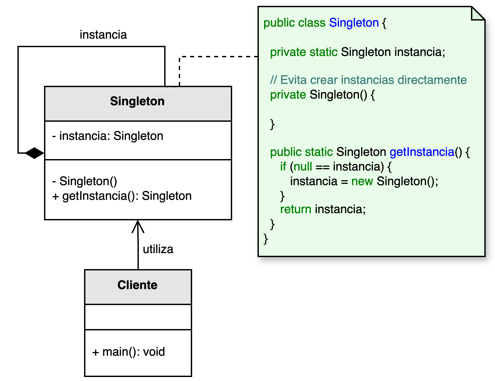

<h1 style="text-align:center;"><strong>🧱 Patrón Singleton (Instancia Única)</strong></h1>

<h4 style="text-align:center;"><em>“Asegura que una clase tenga una única instancia y proporcione un punto de acceso global a ella.”</em></h4>

<p style="text-align: justify;">
El <b>patrón Singleton</b> pertenece a la familia de los <b>patrones creacionales</b> y tiene como propósito <b>restringir la creación de objetos</b> de una clase a una única instancia.  
De esta manera, garantiza que todos los componentes del sistema utilicen el mismo objeto compartido, controlando el acceso global a recursos comunes y evitando la duplicación innecesaria de instancias.
</p>

<hr/>

<h2><strong>🧭 Motivación</strong></h2>
<p style="text-align: justify;">
Existen situaciones en las que solo debe existir una instancia de una clase para garantizar la coherencia del sistema.  
Por ejemplo, cuando se gestiona una <b>conexión de base de datos</b>, un <b>servicio de configuración global</b>, un <b>sistema de registro (logger)</b> o una <b>caché compartida</b>.  
En estos casos, permitir múltiples instancias podría provocar conflictos, uso ineficiente de recursos o comportamientos inconsistentes.
</p>
<p style="text-align: justify;">
El patrón Singleton propone una solución simple y controlada: encapsular la creación del objeto dentro de la propia clase, de forma que solo exista una instancia accesible a través de un método estático.
</p>

<hr/>

<h2><strong>🧩 Estructura del patrón</strong></h2>
<p style="text-align: justify;">
De acuerdo con el modelo UML, la clase <b>Singleton</b> se asocia a sí misma mediante una relación reflexiva.  
El constructor privado (<code>private</code>) impide la creación directa de instancias externas, mientras que el método estático <code>getInstance()</code> controla y devuelve siempre la misma referencia al objeto único.
</p>
<p style="text-align:center;">
  
</p>
<p style="text-align:center;"><b>Figura 1.</b> Diagrama UML del patrón <i>Singleton</i>.</p>

<hr/>

<h2><strong>👥 Participantes</strong></h2>
<table>
  <thead>
    <tr>
      <th style="text-align:center;">Elemento</th>
      <th style="text-align:justify;">Descripción</th>
    </tr>
  </thead>
  <tbody>
    <tr>
      <td style="text-align:center;"><b>Singleton</b></td>
      <td style="text-align:justify;">Clase que define un método estático (<code>getInstance()</code>) responsable de crear o devolver la única instancia existente. El constructor es privado para evitar instanciaciones externas.</td>
    </tr>
  </tbody>
</table>

<hr/>

<h2><strong>⚙️ Implementación básica en Java</strong></h2>

```java
public class Singleton {
    // Instancia única
    private static Singleton instancia;

    // Constructor privado
    private Singleton() {}

    // Método de acceso global
    public static Singleton getInstance() {
        if (instancia == null) {
            instancia = new Singleton();
        }
        return instancia;
    }

    public void mostrarMensaje() {
        System.out.println("Instancia única en ejecución");
    }
}
```

<hr/>

<h2><strong>🌟 Ventajas</strong></h2>
<ul style="text-align: justify;">
  <li><b>Control de instancia:</b> garantiza que solo exista un objeto activo en el sistema.</li>
  <li><b>Acceso global:</b> provee un punto de acceso centralizado, facilitando la coordinación entre componentes.</li>
  <li><b>Inicialización perezosa:</b> permite crear la instancia solo cuando es necesaria, optimizando recursos.</li>
  <li><b>Gestión eficiente:</b> ideal para manejar recursos compartidos como conexiones, logs o configuraciones.</li>
</ul>

<hr/>

<h2><strong>⚠️ Desventajas y críticas</strong></h2>
<p style="text-align: justify;">
A pesar de su utilidad, el patrón <b>Singleton</b> es objeto de críticas, pues puede violar principios fundamentales del diseño orientado a objetos como <b>responsabilidad única (SRP)</b> y <b>abierto/cerrado (OCP)</b>.  
Su uso indiscriminado puede dificultar la prueba, la extensión y el mantenimiento del código.
</p>
<ul style="text-align: justify;">
  <li><b>Acoplamiento global:</b> los objetos dependientes del Singleton se vuelven difíciles de aislar y probar.</li>
  <li><b>Violación de SRP:</b> la clase asume la doble responsabilidad de su lógica interna y del control de su propia instancia.</li>
  <li><b>Problemas de concurrencia:</b> en entornos multihilo, es necesario sincronizar la creación de la instancia.</li>
  <li><b>Dificultad para refactorizar:</b> al depender de una instancia única global, el sistema puede volverse menos flexible ante cambios futuros.</li>
</ul>

<hr/>

<h2><strong>🧮 Escenarios de aplicación</strong></h2>
<table>
  <thead>
    <tr>
      <th style="text-align:center;">💼 Contexto</th>
      <th style="text-align:justify;">📘 Aplicación del patrón</th>
    </tr>
  </thead>
  <tbody>
    <tr>
      <td style="text-align:center;"><b>Gestión de conexiones</b></td>
      <td style="text-align:justify;">Controla la creación de conexiones a bases de datos, asegurando el uso de una única instancia compartida.</td>
    </tr>
    <tr>
      <td style="text-align:center;"><b>Configuración global</b></td>
      <td style="text-align:justify;">Centraliza parámetros o configuraciones de la aplicación accesibles desde distintos módulos.</td>
    </tr>
    <tr>
      <td style="text-align:center;"><b>Registro (Logging)</b></td>
      <td style="text-align:justify;">Permite registrar eventos del sistema desde múltiples clases usando un único punto de acceso.</td>
    </tr>
    <tr>
      <td style="text-align:center;"><b>Manejo de caché</b></td>
      <td style="text-align:justify;">Almacena objetos costosos de generar, optimizando la reutilización de datos en memoria.</td>
    </tr>
    <tr>
      <td style="text-align:center;"><b>Controladores de hardware</b></td>
      <td style="text-align:justify;">Gestiona recursos físicos como impresoras, sensores o dispositivos compartidos en tiempo real.</td>
    </tr>
  </tbody>
</table>

<hr/>

<h2><strong>💡 Recomendaciones de uso</strong></h2>
<ul style="text-align: justify;">
  <li>Utiliza <b>Singleton</b> únicamente cuando la unicidad de la instancia sea un requisito real.</li>
  <li>Considera alternativas como la <b>inyección de dependencias</b> o los <b>contenedores de servicios</b> en sistemas complejos.</li>
  <li>Si el entorno es multihilo, sincroniza el método <code>getInstance()</code> o utiliza inicialización estática segura.</li>
  <li>Mantén la responsabilidad del Singleton enfocada: evita convertirlo en un “gestor global” de múltiples tareas.</li>
</ul>

<hr/>

<h2><strong>📎 Referencia</strong></h2>
<p style="text-align: justify;">
Este material corresponde al patrón <b>Singleton (Instancia Única)</b> descrito en el libro  
<i><b>Notas a mano sobre análisis orientado a objetos y patrones de diseño</b></i> (Orozco, 2025).
</p>