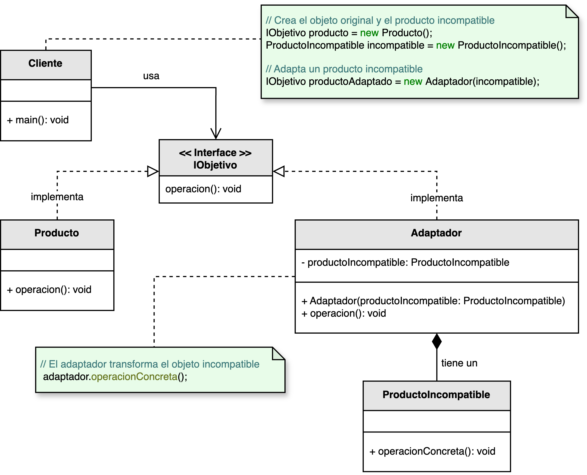

<h1 style="text-align:center;"><strong>🔌 Patrón Adapter (Adaptador)</strong></h1>

<h4 style="text-align:center;"><em>“Permite que clases con interfaces incompatibles colaboren entre sí mediante un
intermediario que traduce sus interacciones.”</em></h4>

<p style="text-align:justify;">
El patrón <b>Adapter</b> pertenece a la familia de los <b>patrones estructurales</b> y tiene como propósito <b>convertir la interfaz de una clase existente</b> en otra que el cliente espera.  
De esta forma, dos clases que no podrían trabajar juntas debido a incompatibilidades pueden hacerlo mediante un <b>adaptador</b> que actúa como traductor entre ambas interfaces.
</p>

<hr/>

<h2><strong>🧭 Motivación</strong></h2>

<p style="text-align:justify;">
En muchos sistemas, existen clases o componentes que realizan funciones similares, pero cuya interfaz difiere debido a decisiones de diseño o evolución tecnológica.  
El patrón <b>Adapter</b> permite integrar estos componentes sin modificar su código fuente, implementando un intermediario que traduce las llamadas de una interfaz a otra.  
Esto es especialmente útil al incorporar <b>APIs externas, bibliotecas de terceros o código legado</b>.
</p>

<hr/>

<h2><strong>🧩 Estructura del patrón</strong></h2>

<p style="text-align:justify;">
La interfaz <b>IObjetivo</b> define las operaciones esperadas por el cliente.  
El <b>Adaptador</b> implementa esta interfaz y traduce las solicitudes del cliente a un formato que pueda entender el <b>ProductoIncompatible</b>.  
De esta forma, se consigue una colaboración transparente entre clases originalmente incompatibles.
</p>

<p style="text-align:center;">
  
</p>
<p style="text-align:center;"><b>Figura 1.</b> Diagrama UML del patrón <i>Adapter</i>.</p>

<hr/>

<h2><strong>👥 Participantes</strong></h2>

<table>
  <thead>
    <tr>
      <th style="text-align:center;">Elemento</th>
      <th style="text-align:justify;">Descripción</th>
    </tr>
  </thead>
  <tbody>
    <tr>
      <td style="text-align:center;"><b>IObjetivo</b></td>
      <td style="text-align:justify;">Define la interfaz esperada por el cliente, centralizando las operaciones entre dos clases inicialmente incompatibles.</td>
    </tr>
    <tr>
      <td style="text-align:center;"><b>Producto</b></td>
      <td style="text-align:justify;">Clase que representa la estructura conocida por el sistema cliente.</td>
    </tr>
    <tr>
      <td style="text-align:center;"><b>ProductoIncompatible</b></td>
      <td style="text-align:justify;">Clase existente con una interfaz diferente, que necesita ser adaptada para trabajar con el sistema.</td>
    </tr>
    <tr>
      <td style="text-align:center;"><b>Adaptador</b></td>
      <td style="text-align:justify;">Implementa la interfaz <b>IObjetivo</b> y traduce las llamadas del cliente al formato esperado por <b>ProductoIncompatible</b>.</td>
    </tr>
    <tr>
      <td style="text-align:center;"><b>Cliente</b></td>
      <td style="text-align:justify;">Utiliza la interfaz <b>IObjetivo</b> sin preocuparse de las conversiones internas entre productos incompatibles.</td>
    </tr>
  </tbody>
</table>

<hr/>

<h2><strong>⚙️ Implementación básica en Java</strong></h2>

```java
// Interfaz objetivo
interface IObjetivo {
    void operacion();
}

// Clase conocida por el sistema
class Producto implements IObjetivo {
    public void operacion() {
        System.out.println("Ejecutando operación estándar del producto.");
    }
}

// Clase incompatible
class ProductoIncompatible {
    public void operacionIncompatible() {
        System.out.println("Ejecutando operación incompatible del producto legado.");
    }
}

// Adaptador que traduce las llamadas
class Adaptador implements IObjetivo {
    private ProductoIncompatible productoIncompatible;

    public Adaptador(ProductoIncompatible productoIncompatible) {
        this.productoIncompatible = productoIncompatible;
    }

    @Override
    public void operacion() {
        // Traducción de llamada
        System.out.println("Adaptando la interfaz...");
        productoIncompatible.operacionIncompatible();
    }
}

// Cliente
public class Main {
    public static void main(String[] args) {
        IObjetivo adaptador = new Adaptador(new ProductoIncompatible());
        adaptador.operacion();
    }
}
```

<hr/>

<h2><strong>🌟 Ventajas</strong></h2>

<ul style="text-align:justify;">
  <li><b>Reutilización de código:</b> permite aprovechar clases existentes sin modificarlas.</li>
  <li><b>Flexibilidad:</b> facilita la integración con APIs externas o sistemas legados.</li>
  <li><b>Desacoplamiento:</b> el cliente trabaja con la interfaz <b>IObjetivo</b>, sin conocer las clases concretas.</li>
  <li><b>Escalabilidad:</b> nuevos adaptadores pueden añadirse sin alterar el código del cliente.</li>
</ul>

<hr/>

<h2><strong>⚠️ Desventajas</strong></h2>

<ul style="text-align:justify;">
  <li><b>Complejidad adicional:</b> introduce capas intermedias que pueden dificultar la lectura del código.</li>
  <li><b>Potencial sobrecarga:</b> el uso excesivo de adaptadores puede afectar el rendimiento en sistemas críticos.</li>
  <li><b>Diseño menos claro:</b> la proliferación de adaptadores puede derivar en arquitecturas difíciles de mantener.</li>
</ul>

<hr/>

<h2><strong>🧮 Escenarios de aplicación</strong></h2>

<table>
  <thead>
    <tr>
      <th style="text-align:center;">💼 Contexto</th>
      <th style="text-align:justify;">📘 Aplicación del patrón</th>
    </tr>
  </thead>
  <tbody>
    <tr>
      <td style="text-align:center;"><b>Integración de sistemas externos</b></td>
      <td style="text-align:justify;">Permite conectar el sistema actual con librerías o servicios de terceros mediante un adaptador que traduce las interfaces.</td>
    </tr>
    <tr>
      <td style="text-align:center;"><b>Compatibilidad con formatos antiguos</b></td>
      <td style="text-align:justify;">Permite que una aplicación moderna trabaje con datos o APIs legadas sin alterar su código base.</td>
    </tr>
    <tr>
      <td style="text-align:center;"><b>Extensión mediante plugins</b></td>
      <td style="text-align:justify;">Facilita la incorporación de nuevas funcionalidades a través de adaptadores que integran plugins con diferentes interfaces.</td>
    </tr>
    <tr>
      <td style="text-align:center;"><b>Adaptación de interfaces gráficas</b></td>
      <td style="text-align:justify;">Permite reutilizar componentes visuales diseñados para frameworks distintos adaptando sus métodos y eventos.</td>
    </tr>
  </tbody>
</table>

<hr/>

<h2><strong>📎 Referencia</strong></h2>

<p style="text-align:justify;">
Este material corresponde al patrón <b>Adapter (Adaptador)</b> descrito en el libro  
<i><b>Notas a mano sobre análisis orientado a objetos y patrones de diseño</b></i> (Orozco, 2025).
</p>