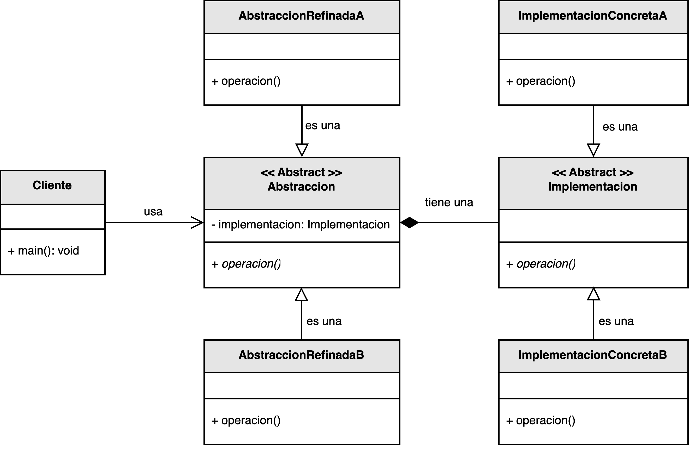

<h1 style="text-align:center;"><strong>🌉 Patrón Bridge (Puente)</strong></h1>

<h4 style="text-align:center;"><em>“Separa una abstracción de su implementación, permitiendo que ambas evolucionen de forma independiente.”</em></h4>

<p style="text-align:justify;">
El patrón <b>Bridge</b> pertenece a la familia de los <b>patrones estructurales</b> y tiene como propósito evitar jerarquías de clases demasiado profundas, promoviendo el principio de <b>composición sobre herencia</b>.  
Este patrón desacopla una abstracción de su implementación, de modo que ambas puedan modificarse sin afectarse mutuamente.
</p>

<hr/>

<h2><strong>🧭 Motivación</strong></h2>

<p style="text-align:justify;">
En el diseño orientado a objetos, las jerarquías con múltiples niveles de herencia tienden a generar una explosión combinatoria de clases cuando se agregan nuevas funcionalidades o variantes.  
Por ejemplo, si tenemos una jerarquía que representa <i>Formas</i> (Círculo, Cuadrado) y otra que representa <i>Colores</i> (Rojo, Azul), podríamos terminar creando subclases para cada combinación (<code>CírculoRojo</code>, <code>CírculoAzul</code>, <code>CuadradoRojo</code>, etc.).  
El patrón <b>Bridge</b> soluciona este problema separando las dos jerarquías, uniendo la abstracción (<i>Forma</i>) y la implementación (<i>Color</i>) mediante composición.
</p>

<hr/>

<h2><strong>🧩 Estructura del patrón</strong></h2>

<p style="text-align:justify;">
La clase <b>Abstraccion</b> define la interfaz de alto nivel consumida por el cliente.  
Las clases <b>AbstraccionRefinada</b> implementan o amplían esta abstracción.  
Por su parte, <b>Implementacion</b> define las operaciones primitivas que deben realizar las subclases concretas, como <b>ImplementacionConcreta</b>.  
Así, la <b>Abstraccion</b> mantiene una referencia a una instancia de <b>Implementacion</b>, estableciendo un puente entre ambas jerarquías.
</p>

<p style="text-align:center;">
  
</p>

<p style="text-align:center;"><b>Figura 1.</b> Diagrama UML del patrón <i>Bridge</i>.</p>

<hr/>

<h2><strong>⚙️ Implementación básica en Java</strong></h2>

<p style="text-align:justify;">
En el siguiente ejemplo, una abstracción <code>Forma</code> delega el detalle del color a una implementación de la interfaz <code>Color</code>.  
Esto permite agregar nuevas formas o colores sin modificar las clases existentes.
</p>

<br/>

```java
// Implementación
interface Color {
    void aplicarColor();
}

class Rojo implements Color {
    public void aplicarColor() {
        System.out.println("Color rojo aplicado.");
    }
}

class Azul implements Color {
    public void aplicarColor() {
        System.out.println("Color azul aplicado.");
    }
}

// Abstracción
abstract class Forma {
    protected Color color;

    public Forma(Color color) {
        this.color = color;
    }

    abstract void dibujar();
}

// Abstracción refinada
class Circulo extends Forma {
    public Circulo(Color color) {
        super(color);
    }

    public void dibujar() {
        System.out.print("Dibujando un círculo. ");
        color.aplicarColor();
    }
}

class Cuadrado extends Forma {
    public Cuadrado(Color color) {
        super(color);
    }

    public void dibujar() {
        System.out.print("Dibujando un cuadrado. ");
        color.aplicarColor();
    }
}

// Cliente
public class Main {
    public static void main(String[] args) {
        Forma circuloRojo = new Circulo(new Rojo());
        Forma cuadradoAzul = new Cuadrado(new Azul());

        circuloRojo.dibujar();
        cuadradoAzul.dibujar();
    }
}
```

<br/>

<hr/>

<h2><strong>👥 Participantes</strong></h2>

<table>
  <thead>
    <tr>
      <th style="text-align:center;">Elemento</th>
      <th style="text-align:justify;">Descripción</th>
    </tr>
  </thead>
  <tbody>
    <tr>
      <td style="text-align:center;"><b>Abstraccion</b></td>
      <td style="text-align:justify;">Define la interfaz de alto nivel utilizada por el cliente y mantiene una referencia a un objeto de tipo Implementacion.</td>
    </tr>
    <tr>
      <td style="text-align:center;"><b>AbstraccionRefinada</b></td>
      <td style="text-align:justify;">Extiende la abstracción, agregando funcionalidades específicas.</td>
    </tr>
    <tr>
      <td style="text-align:center;"><b>Implementacion</b></td>
      <td style="text-align:justify;">Define la interfaz para las operaciones básicas que las implementaciones concretas deben realizar.</td>
    </tr>
    <tr>
      <td style="text-align:center;"><b>ImplementacionConcreta</b></td>
      <td style="text-align:justify;">Proporciona una implementación concreta de las operaciones definidas por la interfaz Implementacion.</td>
    </tr>
    <tr>
      <td style="text-align:center;"><b>Cliente</b></td>
      <td style="text-align:justify;">Interactúa con la Abstraccion sin conocer los detalles de la Implementacion concreta.</td>
    </tr>
  </tbody>
</table>

<hr/>

<h2><strong>🌟 Ventajas</strong></h2>

<ul style="text-align:justify;">
  <li><b>Desacoplamiento:</b> la abstracción y su implementación pueden evolucionar de forma independiente.</li>
  <li><b>Extensibilidad:</b> permite añadir nuevas abstracciones e implementaciones sin modificar las existentes.</li>
  <li><b>Reutilización:</b> las implementaciones pueden reutilizarse con diferentes abstracciones.</li>
  <li><b>Mantenimiento:</b> favorece un código más limpio y fácil de mantener.</li>
</ul>

<hr/>

<h2><strong>⚠️ Desventajas</strong></h2>

<ul style="text-align:justify;">
  <li><b>Complejidad inicial:</b> introduce más clases y abstracciones, lo que puede complicar el diseño en sistemas pequeños.</li>
  <li><b>Mayor esfuerzo conceptual:</b> requiere comprender bien las relaciones de composición para aplicarlo correctamente.</li>
</ul>

<hr/>

<h2><strong>🧮 Escenarios de aplicación</strong></h2>

<table>
  <thead>
    <tr>
      <th style="text-align:center;">💼 Contexto</th>
      <th style="text-align:justify;">📘 Aplicación del patrón</th>
    </tr>
  </thead>
  <tbody>
    <tr>
      <td style="text-align:center;"><b>Interfaces multiplataforma</b></td>
      <td style="text-align:justify;">Permite crear interfaces de usuario que funcionan en distintos sistemas operativos, conectando abstracciones comunes con implementaciones específicas de cada plataforma.</td>
    </tr>
    <tr>
      <td style="text-align:center;"><b>Gestión de recursos multimedia</b></td>
      <td style="text-align:justify;">Facilita la separación entre la representación lógica de un recurso (audio, video, imagen) y su implementación técnica (drivers o codecs específicos).</td>
    </tr>
    <tr>
      <td style="text-align:center;"><b>Bibliotecas gráficas</b></td>
      <td style="text-align:justify;">Permite definir una interfaz de dibujo independiente de la API gráfica subyacente (por ejemplo, OpenGL, DirectX o Vulkan).</td>
    </tr>
  </tbody>
</table>

<hr/>

<h2><strong>📎 Referencia</strong></h2>

<p style="text-align:justify;">
Este material corresponde al patrón <b>Bridge (Puente)</b> descrito en el libro  
<i><b>Notas a mano sobre análisis orientado a objetos y patrones de diseño</b></i> (Orozco, 2025).
</p>