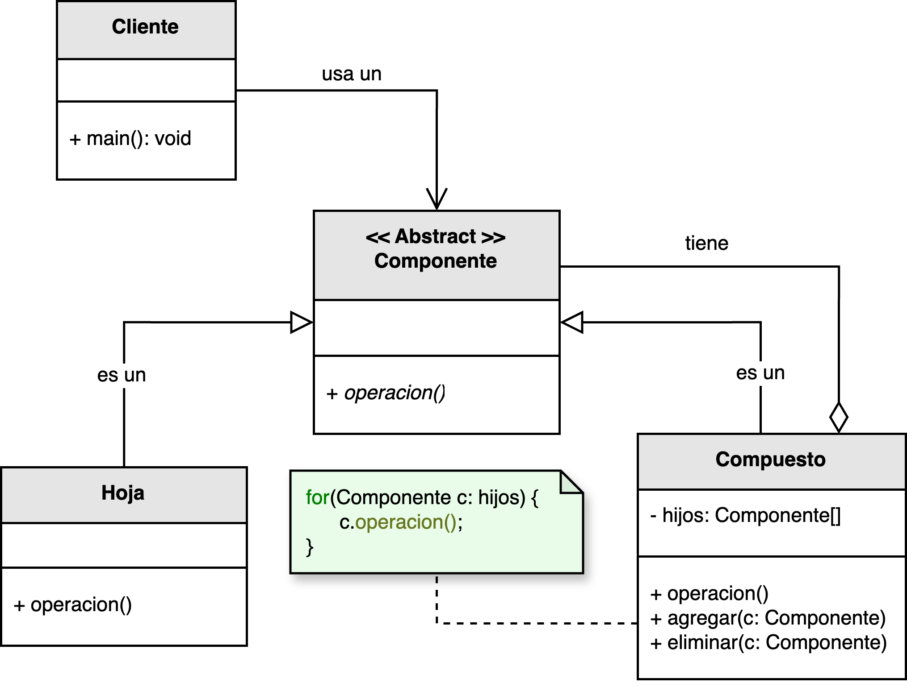

<h1 style="text-align:center;"><strong>🌲 Patrón Composite (Compuesto)</strong></h1>

<h4 style="text-align:center;"><em>“Compone objetos en estructuras de árbol para representar jerarquías
todo-parte.”</em></h4>

<p style="text-align:justify;">
El patrón <b>Composite</b> pertenece a la familia de los <b>patrones estructurales</b> y tiene como propósito unificar el tratamiento de los objetos individuales y de las composiciones de objetos.  
Permite construir estructuras jerárquicas donde cada elemento del árbol puede comportarse como una unidad individual (<i>hoja</i>) o como un contenedor de otros elementos (<i>compuesto</i>).
</p>

<hr/>

<h2><strong>🧭 Motivación</strong></h2>

<p style="text-align:justify;">
En muchos sistemas, es común que los objetos individuales y las colecciones de objetos se traten de manera diferente, lo que genera complejidad adicional en el código.  
El patrón <b>Composite</b> permite tratar de forma uniforme a ambos, gracias a una interfaz común que representa tanto a las <i>hojas</i> (elementos simples) como a los <i>compuestos</i> (colecciones de elementos).  
Este modelo es ideal para representar estructuras jerárquicas “todo-parte”, como sistemas de archivos, interfaces gráficas o árboles sintácticos.
</p>

<hr/>

<h2><strong>🧩 Estructura del patrón</strong></h2>

<p style="text-align:justify;">
La clase <b>Componente</b> define la interfaz común para todos los objetos del árbol, ya sean simples o compuestos.  
La clase <b>Compuesto</b> mantiene una lista de objetos <b>Componente</b> y delega las operaciones a sus hijos.  
Finalmente, la clase <b>Hoja</b> representa los objetos indivisibles que no contienen otros componentes.
</p>

<p style="text-align:center;">
  
</p>

<p style="text-align:center;"><b>Figura 1.</b> Diagrama UML del patrón <i>Composite</i>.</p>

<hr/>

<h2><strong>⚙️ Implementación básica en Java</strong></h2>

<p style="text-align:justify;">
A continuación se muestra un ejemplo simple que representa una estructura jerárquica de componentes.  
Cada nodo puede ser una <code>Hoja</code> o un <code>Compuesto</code> que contiene múltiples elementos.  
El cliente puede tratar todos los objetos de la misma manera gracias a la interfaz <code>Componente</code>.
</p>

<br/>

```java
// Componente
interface Componente {
    void mostrar(int nivel);
}

// Hoja
class Hoja implements Componente {
    private String nombre;

    public Hoja(String nombre) {
        this.nombre = nombre;
    }

    @Override
    public void mostrar(int nivel) {
        System.out.println("  ".repeat(nivel) + "- Hoja: " + nombre);
    }
}

// Compuesto
import java.util.ArrayList;
import java.util.List;

class Compuesto implements Componente {
    private String nombre;
    private List&lt;Componente&gt;hijos =new ArrayList&lt;&gt;();

    public Compuesto(String nombre) {
        this.nombre = nombre;
    }

    public void agregar(Componente componente) {
        hijos.add(componente);
    }

    public void eliminar(Componente componente) {
        hijos.remove(componente);
    }

    @Override
    public void mostrar(int nivel) {
        System.out.println("  ".repeat(nivel) + "+ Compuesto: " + nombre);
        for (Componente hijo : hijos) {
            hijo.mostrar(nivel + 1);
        }
    }
}

// Cliente
public class Main {
    public static void main(String[] args) {
        Compuesto raiz = new Compuesto("Raíz");
        Compuesto carpeta1 = new Compuesto("Carpeta A");
        Compuesto carpeta2 = new Compuesto("Carpeta B");

        Hoja archivo1 = new Hoja("Archivo 1.txt");
        Hoja archivo2 = new Hoja("Archivo 2.txt");
        Hoja archivo3 = new Hoja("Archivo 3.txt");

        carpeta1.agregar(archivo1);
        carpeta1.agregar(archivo2);
        carpeta2.agregar(archivo3);

        raiz.agregar(carpeta1);
        raiz.agregar(carpeta2);

        raiz.mostrar(0);
    }
}
```

<br/>

<hr/>

<h2><strong>👥 Participantes</strong></h2>

<table>
  <thead>
    <tr>
      <th style="text-align:center;">Elemento</th>
      <th style="text-align:justify;">Descripción</th>
    </tr>
  </thead>
  <tbody>
    <tr>
      <td style="text-align:center;"><b>Componente</b></td>
      <td style="text-align:justify;">Declara la interfaz común para los objetos simples y compuestos, permitiendo el tratamiento uniforme de ambos.</td>
    </tr>
    <tr>
      <td style="text-align:center;"><b>Compuesto</b></td>
      <td style="text-align:justify;">Define el comportamiento de los objetos que pueden tener hijos y almacena una colección de componentes.</td>
    </tr>
    <tr>
      <td style="text-align:center;"><b>Hoja</b></td>
      <td style="text-align:justify;">Representa los objetos terminales de la jerarquía, que no tienen hijos.</td>
    </tr>
    <tr>
      <td style="text-align:center;"><b>Cliente</b></td>
      <td style="text-align:justify;">Manipula objetos a través de la interfaz <b>Componente</b> sin distinguir entre hojas y compuestos.</td>
    </tr>
  </tbody>
</table>

<hr/>

<h2><strong>🌟 Ventajas</strong></h2>

<ul style="text-align:justify;">
  <li><b>Extensibilidad:</b> facilita la adición de nuevos tipos de componentes sin modificar el código existente.</li>
  <li><b>Uniformidad:</b> permite tratar objetos simples y compuestos de la misma forma.</li>
  <li><b>Flexibilidad:</b> se pueden crear estructuras complejas en tiempo de ejecución a partir de elementos simples.</li>
  <li><b>Claridad:</b> refleja de manera natural relaciones todo-parte, haciendo el modelo más comprensible.</li>
</ul>

<hr/>

<h2><strong>⚠️ Desventajas</strong></h2>

<ul style="text-align:justify;">
  <li><b>Interfaz común obligatoria:</b> todos los objetos deben compartir la misma interfaz, incluso si algunos métodos no son aplicables a ciertos componentes.</li>
  <li><b>Diseño complejo:</b> diseñar jerarquías equilibradas puede resultar difícil, especialmente si se agregan operaciones específicas a los compuestos.</li>
  <li><b>Generalización excesiva:</b> puede hacer más difícil restringir qué tipos de objetos forman parte de la composición.</li>
</ul>

<hr/>

<h2><strong>🧮 Escenarios de aplicación</strong></h2>

<table>
  <thead>
    <tr>
      <th style="text-align:center;">💼 Contexto</th>
      <th style="text-align:justify;">📘 Aplicación del patrón</th>
    </tr>
  </thead>
  <tbody>
    <tr>
      <td style="text-align:center;"><b>Sistemas de archivos</b></td>
      <td style="text-align:justify;">Modela carpetas y archivos, donde ambos pueden ser tratados como elementos del sistema de archivos.</td>
    </tr>
    <tr>
      <td style="text-align:center;"><b>Interfaces gráficas (GUI)</b></td>
      <td style="text-align:justify;">Permite organizar controles de interfaz (botones, paneles, menús) como una jerarquía de componentes anidados.</td>
    </tr>
    <tr>
      <td style="text-align:center;"><b>Estructuras organizacionales</b></td>
      <td style="text-align:justify;">Representa jerarquías de departamentos, equipos y empleados, donde cada nivel puede contener o depender de otros.</td>
    </tr>
    <tr>
      <td style="text-align:center;"><b>Gráficos vectoriales</b></td>
      <td style="text-align:justify;">Permite componer imágenes complejas a partir de primitivas simples como líneas y círculos.</td>
    </tr>
  </tbody>
</table>

<hr/>

<h2><strong>📎 Referencia</strong></h2>

<p style="text-align:justify;">
Este material corresponde al patrón <b>Composite (Compuesto)</b> descrito en el libro  
<i><b>Notas a mano sobre análisis orientado a objetos y patrones de diseño</b></i> (Orozco, 2025).
</p>