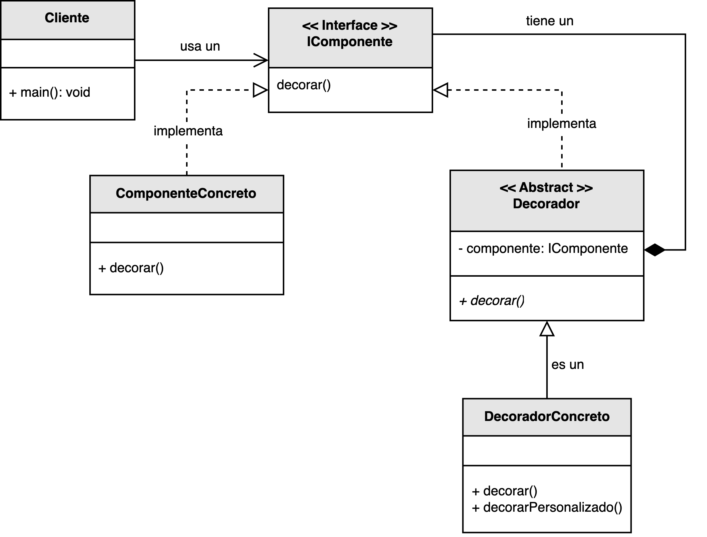

<h1 style="text-align:center;"><strong>🎨 Patrón Decorator (Decorador)</strong></h1>

<h4 style="text-align:center;"><em>“Permite añadir responsabilidades adicionales a un objeto de forma dinámica sin modificar su estructura.”</em></h4>

<p style="text-align:justify;">
El patrón <b>Decorator</b> pertenece a la familia de los <b>patrones estructurales</b> y tiene como propósito extender el comportamiento de los objetos en tiempo de ejecución sin recurrir a la herencia.  
Para ello, encapsula el objeto original dentro de otro objeto decorador que implementa la misma interfaz y que añade nuevas funcionalidades antes o después de delegar la llamada al objeto original.
</p>

<hr/>

<h2><strong>🧭 Motivación</strong></h2>

<p style="text-align:justify;">
En muchos casos, los desarrolladores buscan añadir nuevas capacidades a una clase mediante herencia.  
Sin embargo, esta práctica genera clases rígidas, acopladas y difíciles de mantener.  
El patrón <b>Decorator</b> ofrece una alternativa más flexible basada en <b>composición</b>: en lugar de heredar, se “envuelve” el objeto original dentro de una capa adicional que amplía su comportamiento sin alterar su código interno.
</p>

<hr/>

<h2><strong>🧩 Estructura del patrón</strong></h2>

<p style="text-align:justify;">
La interfaz <b>IComponente</b> define la operación principal que los objetos pueden ejecutar.  
El <b>ComponenteConcreto</b> implementa esta operación con la funcionalidad básica.  
La clase <b>Decorador</b> mantiene una referencia a un objeto <b>IComponente</b> y delega en él las operaciones, mientras que el <b>DecoradorConcreto</b> añade nuevas responsabilidades o comportamientos antes o después de delegar la llamada.
</p>

<p style="text-align:center;">
  
</p>

<p style="text-align:center;"><b>Figura 1.</b> Diagrama UML del patrón <i>Decorator</i>.</p>

<hr/>

<h2><strong>⚙️ Implementación básica en Java</strong></h2>

<p style="text-align:justify;">
En el siguiente ejemplo, el patrón <code>Decorator</code> se utiliza para agregar dinámicamente nuevas funcionalidades a un componente base.  
Cada decorador envuelve al componente anterior, lo que permite combinar múltiples comportamientos sin modificar las clases originales.
</p>

<br/>

```java
// Interfaz del componente
interface IComponente {
    void operar();
}

// Componente concreto
class ComponenteConcreto implements IComponente {
    @Override
    public void operar() {
        System.out.println("Ejecutando operación base del componente.");
    }
}

// Decorador base
abstract class Decorador implements IComponente {
    protected IComponente componente;

    public Decorador(IComponente componente) {
        this.componente = componente;
    }

    @Override
    public void operar() {
        componente.operar();
    }
}

// Decoradores concretos
class DecoradorLog extends Decorador {
    public DecoradorLog(IComponente componente) {
        super(componente);
    }

    @Override
    public void operar() {
        System.out.println("[Log] Antes de ejecutar la operación.");
        super.operar();
        System.out.println("[Log] Después de ejecutar la operación.");
    }
}

class DecoradorSeguridad extends Decorador {
    public DecoradorSeguridad(IComponente componente) {
        super(componente);
    }

    @Override
    public void operar() {
        System.out.println("[Seguridad] Verificando permisos...");
        super.operar();
    }
}

// Cliente
public class Main {
    public static void main(String[] args) {
        IComponente componente = new ComponenteConcreto();
        IComponente decorado = new DecoradorSeguridad(new DecoradorLog(componente));

        decorado.operar();
    }
}
```

<br/>

<hr/>

<h2><strong>👥 Participantes</strong></h2>

<table>
  <thead>
    <tr>
      <th style="text-align:center;">Elemento</th>
      <th style="text-align:justify;">Descripción</th>
    </tr>
  </thead>
  <tbody>
    <tr>
      <td style="text-align:center;"><b>IComponente</b></td>
      <td style="text-align:justify;">Declara la interfaz común para todos los objetos que pueden ser decorados.</td>
    </tr>
    <tr>
      <td style="text-align:center;"><b>ComponenteConcreto</b></td>
      <td style="text-align:justify;">Implementa la operación base sobre la cual se aplicarán las decoraciones adicionales.</td>
    </tr>
    <tr>
      <td style="text-align:center;"><b>Decorador</b></td>
      <td style="text-align:justify;">Clase abstracta que implementa la interfaz <b>IComponente</b> y mantiene una referencia al objeto decorado.</td>
    </tr>
    <tr>
      <td style="text-align:center;"><b>DecoradorConcreto</b></td>
      <td style="text-align:justify;">Extiende la funcionalidad del componente agregando nuevas responsabilidades.</td>
    </tr>
    <tr>
      <td style="text-align:center;"><b>Cliente</b></td>
      <td style="text-align:justify;">Interactúa con los componentes a través de la interfaz común, sin conocer si están decorados o no.</td>
    </tr>
  </tbody>
</table>

<hr/>

<h2><strong>🌟 Ventajas</strong></h2>

<ul style="text-align:justify;">
  <li><b>Extensibilidad dinámica:</b> permite añadir o combinar responsabilidades sin modificar las clases originales.</li>
  <li><b>Evita la herencia:</b> fomenta la composición en lugar de jerarquías rígidas.</li>
  <li><b>Reutilización:</b> los decoradores pueden aplicarse a múltiples objetos.</li>
  <li><b>Flexibilidad:</b> se pueden apilar múltiples decoradores para obtener comportamientos compuestos.</li>
</ul>

<hr/>

<h2><strong>⚠️ Desventajas</strong></h2>

<ul style="text-align:justify;">
  <li><b>Complejidad estructural:</b> puede dar lugar a numerosos objetos pequeños y difíciles de seguir.</li>
  <li><b>Encapsulamiento débil:</b> si el decorador necesita acceder a detalles internos del componente, puede romper el principio de encapsulación.</li>
  <li><b>Sobreanidación:</b> un exceso de decoradores puede complicar el flujo de ejecución.</li>
</ul>

<hr/>

<h2><strong>🧮 Escenarios de aplicación</strong></h2>

<table>
  <thead>
    <tr>
      <th style="text-align:center;">💼 Contexto</th>
      <th style="text-align:justify;">📘 Aplicación del patrón</th>
    </tr>
  </thead>
  <tbody>
    <tr>
      <td style="text-align:center;"><b>Interfaces gráficas (GUI)</b></td>
      <td style="text-align:justify;">Permite añadir comportamientos como bordes, sombras o scrollbars sin modificar los componentes base.</td>
    </tr>
    <tr>
      <td style="text-align:center;"><b>Flujos de datos (I/O Streams)</b></td>
      <td style="text-align:justify;">Permite agregar funcionalidades como compresión, cifrado o buffering a flujos de entrada/salida de forma transparente.</td>
    </tr>
    <tr>
      <td style="text-align:center;"><b>Validación de datos</b></td>
      <td style="text-align:justify;">Permite construir cadenas de validadores aplicando diferentes reglas sin modificar los objetos originales.</td>
    </tr>
  </tbody>
</table>

<hr/>

<h2><strong>📎 Referencia</strong></h2>

<p style="text-align:justify;">
Este material corresponde al patrón <b>Decorator (Decorador)</b> descrito en el libro  
<i><b>Notas a mano sobre análisis orientado a objetos y patrones de diseño</b></i> (Orozco, 2025).
</p>