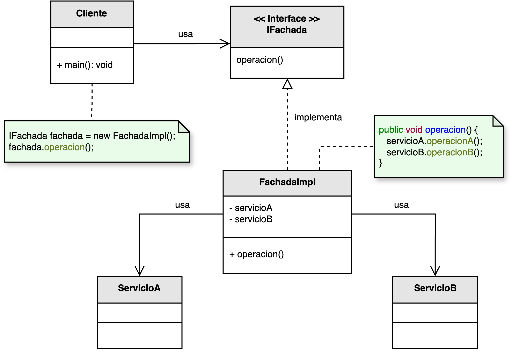

<h1 style="text-align:center;"><strong> Facade (Fachada)</strong></h1>

<h4 style="text-align:center;"><em>“Ofrece una interfaz unificada y sencilla para acceder a un subsistema complejo, ocultando sus detalles internos.”</em></h4>

<p style="text-align:justify;">
El patrón <b>Facade</b> pertenece a los <b>patrones estructurales</b> y su objetivo es <b>simplificar la interacción</b> con uno (o varios) subsistemas.  
Proporciona un <b>punto de entrada único</b> que coordina llamadas, ordena pasos y encapsula complejidad, de modo que el código cliente no necesita conocer las clases, dependencias ni orden preciso de invocación dentro del subsistema.
</p>

<hr/>

<h2><strong>🧭 Motivación</strong></h2>

<p style="text-align:justify;">
En proyectos reales, bibliotecas y módulos suelen exponer múltiples clases y operaciones con dependencias entre sí (autenticación, validaciones, adaptadores, conversores, etc.).  
Sin una capa de <i>fachada</i>, el cliente debe orquestar pasos y lidiar con errores y estados intermedios.  
<b>Facade</b> centraliza esa orquestación: agrupa llamadas, configura los módulos y devuelve resultados listos para usar, reduciendo el acoplamiento y mejorando la legibilidad.
</p>

<hr/>

<h2><strong>🧩 Estructura del patrón</strong></h2>

<p style="text-align:justify;">
La interfaz <b>IFachada</b> define operaciones de alto nivel.  
La implementación <b>FachadaImpl</b> compone e invoca a uno o más <b>Subsistemas</b>, coordinando su ejecución y manejando errores/estados intermedios.  
El <b>Cliente</b> interactúa solo con la fachada, sin conocer la complejidad interna del subsistema.
</p>

<p style="text-align:center;">
  
</p>
<p style="text-align:center;"><b>Figura 1.</b> Diagrama UML del patrón <i>Facade</i>.</p>

<hr/>

<h2><strong>⚙️ Implementación básica en Java</strong></h2>

<p style="text-align:justify;">
Ejemplo mínimo donde la fachada orquesta tres servicios: autenticación, catálogo y pagos.  
Obsérvese que el cliente solo invoca a la <code>IFachada</code>; el orden de pasos y dependencias queda encapsulado.
</p>

<br/>

```java
// Subsistemas
class ServicioAutenticacion {
    boolean autenticar(String token) {
        System.out.println("Autenticando token...");
        return token != null && !token.isBlank();
    }
}

class ServicioCatalogo {
    String consultarProducto(String id) {
        System.out.println("Consultando producto " + id + "...");
        return "Producto#" + id;
    }
}

class ServicioPagos {
    boolean pagar(String producto, double monto) {
        System.out.println("Pagando " + monto + " por " + producto + "...");
        return monto > 0;
    }
}

// Interfaz de la fachada
interface IFachada {
    boolean comprar(String token, String productoId, double monto);
}

// Implementación de la fachada
class FachadaImpl implements IFachada {
    private final ServicioAutenticacion auth = new ServicioAutenticacion();
    private final ServicioCatalogo catalogo = new ServicioCatalogo();
    private final ServicioPagos pagos = new ServicioPagos();

    @Override
    public boolean comprar(String token, String productoId, double monto) {
        if (!auth.autenticar(token)) {
            System.out.println("Error: autenticación fallida.");
            return false;
        }
        String producto = catalogo.consultarProducto(productoId);
        return pagos.pagar(producto, monto);
    }
}

// Cliente
public class Main {
    public static void main(String[] args) {
        IFachada fachada = new FachadaImpl();
        boolean ok = fachada.comprar("token-demo", "A-123", 49.99);
        System.out.println(ok ? "Compra exitosa" : "Compra fallida");
    }
}
```

<br/>

<hr/>

<h2><strong>👥 Participantes</strong></h2>

<table>
  <thead>
    <tr>
      <th style="text-align:center;">Elemento</th>
      <th style="text-align:justify;">Descripción</th>
    </tr>
  </thead>
  <tbody>
    <tr>
      <td style="text-align:center;"><b>IFachada</b></td>
      <td style="text-align:justify;">Interfaz simplificada que expone operaciones de alto nivel al cliente.</td>
    </tr>
    <tr>
      <td style="text-align:center;"><b>FachadaImpl</b></td>
      <td style="text-align:justify;">Implementa la interfaz de fachada; coordina y orquesta llamadas a los subsistemas.</td>
    </tr>
    <tr>
      <td style="text-align:center;"><b>SubsistemaA / SubsistemaB / ...</b></td>
      <td style="text-align:justify;">Clases concretas con lógica especializada. Permanecen ocultas al cliente.</td>
    </tr>
    <tr>
      <td style="text-align:center;"><b>Cliente</b></td>
      <td style="text-align:justify;">Usa exclusivamente la fachada para ejecutar tareas complejas de forma sencilla.</td>
    </tr>
  </tbody>
</table>

<hr/>

<h2><strong>🌟 Ventajas</strong></h2>

<ul style="text-align:justify;">
  <li><b>Simplicidad y cohesión:</b> provee una API clara para casos de uso frecuentes.</li>
  <li><b>Menor acoplamiento:</b> aísla al cliente de clases internas y dependencias del subsistema.</li>
  <li><b>Encapsulamiento de complejidad:</b> centraliza políticas, orden de pasos y manejo de errores.</li>
  <li><b>Organización por capas:</b> facilita arquitectura en capas (presentación → fachada → dominio/infra).</li>
</ul>

<hr/>

<h2><strong>⚠️ Desventajas</strong></h2>

<ul style="text-align:justify;">
  <li><b>Fachada “Dios”:</b> si concentra demasiadas responsabilidades, viola SRP.</li>
  <li><b>Funcionalidad limitada:</b> puede ocultar operaciones avanzadas que ciertos clientes sí necesitan.</li>
  <li><b>Riesgo de sobreabstracción:</b> una mala división puede añadir más complejidad que beneficios.</li>
</ul>

<hr/>

<h2><strong>🧮 Escenarios de aplicación</strong></h2>

<table>
  <thead>
    <tr>
      <th style="text-align:center;">💼 Contexto</th>
      <th style="text-align:justify;">📘 Aplicación del patrón</th>
    </tr>
  </thead>
  <tbody>
    <tr>
      <td style="text-align:center;"><b>Librerías/frameworks complejos</b></td>
      <td style="text-align:justify;">Ofrece una API simple que cubre la mayoría de casos de uso, evitando que el cliente gestione detalles intrincados.</td>
    </tr>
    <tr>
      <td style="text-align:center;"><b>BFF (Backend For Frontend)</b></td>
      <td style="text-align:justify;">Agrega y adapta datos de múltiples microservicios para un frontend específico.</td>
    </tr>
    <tr>
      <td style="text-align:center;"><b>Integración con sistemas legados</b></td>
      <td style="text-align:justify;">Encapsula protocolos y formatos antiguos tras una interfaz moderna y estable.</td>
    </tr>
    <tr>
      <td style="text-align:center;"><b>Controladores de dispositivos</b></td>
      <td style="text-align:justify;">Simplifica APIs de hardware ofreciendo operaciones de alto nivel (inicializar, leer, cerrar).</td>
    </tr>
  </tbody>
</table>

<hr/>

<h2><strong>📎 Referencia</strong></h2>

<p style="text-align:justify;">
Este material corresponde al patrón <b>Facade (Fachada)</b> descrito en el libro  
<i><b>Notas a mano sobre análisis orientado a objetos y patrones de diseño</b></i> (Orozco, 2025).
</p>