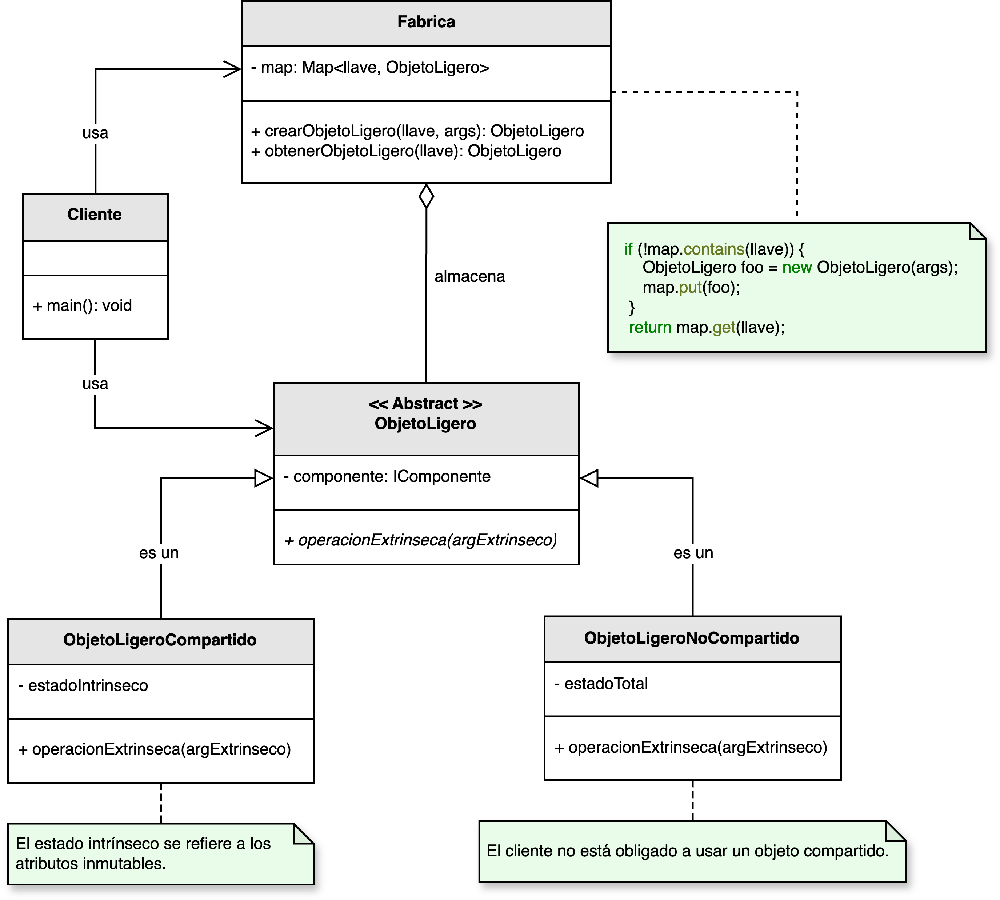

<h1 style="text-align:center;"><strong>🪶 Patrón Flyweight (Peso Ligero)</strong></h1>

<h4 style="text-align:center;"><em>“Minimiza el uso de memoria compartiendo información común entre múltiples
objetos.”</em></h4>

<p style="text-align:justify;">
El patrón <b>Flyweight</b> pertenece a la categoría de <b>patrones estructurales</b> y se utiliza para reducir el consumo de recursos en sistemas que manejan una gran cantidad de objetos similares.  
Su principio fundamental es <b>compartir estados inmutables</b> (intrínsecos) entre múltiples instancias, evitando almacenar información duplicada.
</p>

<hr/>

<h2><strong>🧭 Motivación</strong></h2>

<p style="text-align:justify;">
En contextos donde existen miles de objetos con datos repetidos —por ejemplo, caracteres de texto, partículas gráficas o entidades de un mapa—, el patrón <b>Flyweight</b> evita crear una copia completa de cada objeto.  
En su lugar, extrae la información común y la comparte a través de una fábrica (<b>Fabrica</b>), que administra las instancias ligeras reutilizables.
</p>

<hr/>

<h2><strong>🧩 Estructura del patrón</strong></h2>

<p style="text-align:justify;">
La clase <b>Fabrica</b> centraliza la gestión de objetos ligeros compartidos.  
El <b>ObjetoLigero</b> define la interfaz común, mientras que los objetos concretos (<b>Compartido</b> y <b>NoCompartido</b>) almacenan el estado <b>intrínseco</b> (compartido) y el <b>extrínseco</b> (variable según el contexto).
</p>

<p style="text-align:center;">
  
</p>

<p style="text-align:center;"><b>Figura 1.</b> Diagrama UML del patrón <i>Flyweight</i>.</p>

<hr/>

<h2><strong>⚙️ Implementación básica en Java</strong></h2>

<p style="text-align:justify;">
En el siguiente ejemplo, el patrón <b>Flyweight</b> se aplica para representar círculos con colores compartidos.  
La <code>Fabrica</code> garantiza que los círculos con el mismo color utilicen la misma instancia.
</p>

```java
// Interfaz común para los objetos ligeros
interface Figura {
    void dibujar(int x, int y);
}

// Objeto ligero compartido
class Circulo implements Figura {
    private final String color; // estado intrínseco

    public Circulo(String color) {
        this.color = color;
    }

    @Override
    public void dibujar(int x, int y) {
        System.out.println("Dibujando círculo de color " + color + " en (" + x + ", " + y + ")");
    }
}

// Fábrica Flyweight
class FabricaFiguras {
    private static final java.util.Map&lt;String,Figura&gt;circulos =new java.util.HashMap&lt;&gt;();

    public static Figura obtenerCirculo(String color) {
        Figura circulo = circulos.get(color);
        if (circulo == null) {
            circulo = new Circulo(color);
            circulos.put(color, circulo);
            System.out.println("Creando nuevo círculo de color: " + color);
        }
        return circulo;
    }
}

// Cliente
public class Main {
    public static void main(String[] args) {
        String[] colores = {"Rojo", "Verde", "Azul", "Rojo", "Verde", "Rojo"};
        for (int i = 0; i < colores.length ; i++){
            Figura circulo = FabricaFiguras.obtenerCirculo(colores[i]);
            circulo.dibujar(i * 10, i * 5);
        }
    }
}
```

<hr/>

<h2><strong>👥 Participantes</strong></h2>

<table>
  <thead>
    <tr>
      <th style="text-align:center;">Elemento</th>
      <th style="text-align:justify;">Descripción</th>
    </tr>
  </thead>
  <tbody>
    <tr>
      <td style="text-align:center;"><b>Fabrica</b></td>
      <td style="text-align:justify;">Administra los objetos ligeros y se encarga de crear o reutilizar instancias existentes.</td>
    </tr>
    <tr>
      <td style="text-align:center;"><b>ObjetoLigero</b></td>
      <td style="text-align:justify;">Define la interfaz común para todos los objetos que pueden ser compartidos.</td>
    </tr>
    <tr>
      <td style="text-align:center;"><b>ObjetoLigeroCompartido</b></td>
      <td style="text-align:justify;">Contiene el estado intrínseco (inmutable y compartido entre varios objetos).</td>
    </tr>
    <tr>
      <td style="text-align:center;"><b>ObjetoLigeroNoCompartido</b></td>
      <td style="text-align:justify;">Contiene el estado extrínseco, específico de cada instancia o contexto.</td>
    </tr>
    <tr>
      <td style="text-align:center;"><b>Cliente</b></td>
      <td style="text-align:justify;">Solicita objetos ligeros a la fábrica y maneja los estados extrínsecos de forma externa.</td>
    </tr>
  </tbody>
</table>

<hr/>

<h2><strong>🌟 Ventajas</strong></h2>

<ul style="text-align:justify;">
  <li><b>Optimización de memoria:</b> reduce la duplicación de datos al compartir estados comunes entre objetos similares.</li>
  <li><b>Mayor rendimiento:</b> minimiza el uso de memoria y mejora la velocidad de creación de objetos.</li>
  <li><b>Escalabilidad:</b> permite manejar grandes volúmenes de objetos sin degradar significativamente el rendimiento.</li>
  <li><b>Eficiencia en la gestión de estados:</b> separa la información compartida del contexto específico de cada instancia.</li>
</ul>

<hr/>

<h2><strong>⚠️ Desventajas</strong></h2>

<ul style="text-align:justify;">
  <li><b>Complejidad de diseño:</b> requiere distinguir entre estados intrínsecos (compartidos) y extrínsecos (contextuales).</li>
  <li><b>Gestión adicional:</b> la fábrica debe controlar la coherencia y la validez de las instancias compartidas.</li>
  <li><b>Posible sobrecarga:</b> la gestión de referencias y sincronización puede añadir costos en tiempo de ejecución.</li>
</ul>

<hr/>

<h2><strong>🧮 Escenarios de aplicación</strong></h2>

<table>
  <thead>
    <tr>
      <th style="text-align:center;">💼 Contexto</th>
      <th style="text-align:justify;">📘 Aplicación del patrón</th>
    </tr>
  </thead>
  <tbody>
    <tr>
      <td style="text-align:center;"><b>Sistemas de partículas</b></td>
      <td style="text-align:justify;">Permite manejar miles de partículas (fuego, humo, chispas) compartiendo sus propiedades comunes.</td>
    </tr>
    <tr>
      <td style="text-align:center;"><b>Procesadores de texto</b></td>
      <td style="text-align:justify;">Comparte información de formato de caracteres (fuente, tamaño, color) en documentos extensos.</td>
    </tr>
    <tr>
      <td style="text-align:center;"><b>Renderizado gráfico</b></td>
      <td style="text-align:justify;">Reutiliza texturas, geometrías o modelos 3D en aplicaciones CAD o videojuegos.</td>
    </tr>
    <tr>
      <td style="text-align:center;"><b>Aplicaciones web dinámicas</b></td>
      <td style="text-align:justify;">Permite compartir estilos y comportamientos comunes entre múltiples elementos DOM.</td>
    </tr>
  </tbody>
</table>

<hr/>

<h2><strong>📎 Referencia</strong></h2>

<p style="text-align:justify;">
Este material corresponde al patrón <b>Flyweight (Peso Ligero)</b> descrito en el libro  
<i><b>Notas a mano sobre análisis orientado a objetos y patrones de diseño</b></i> (Orozco, 2025).
</p>