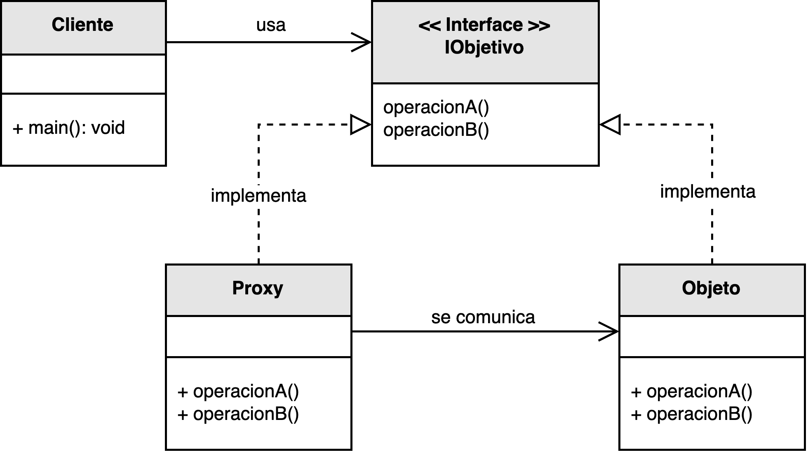

<h1 style="text-align:center;"><strong>🛰️ Patrón Proxy (Intermediario)</strong></h1>

<h4 style="text-align:center;"><em>“Proporciona un sustituto o representante de otro objeto para controlar su
acceso.”</em></h4>

<p style="text-align:justify;">
El patrón <b>Proxy</b> pertenece a los <b>patrones estructurales</b> y tiene como objetivo controlar el acceso a un objeto, 
proveyendo una capa intermediaria entre el cliente y el recurso real.  
El proxy actúa como un sustituto, pudiendo añadir comportamientos adicionales como validación, registro, carga diferida o comunicación remota antes de delegar la operación al objeto original.
</p>

<hr/>

<h2><strong>🧭 Motivación</strong></h2>

<p style="text-align:justify;">
El patrón <b>Proxy</b> se utiliza cuando se desea ejercer control sobre el acceso a objetos costosos o sensibles.  
Puede retrasar la creación de objetos complejos hasta que sean necesarios (proxy virtual), controlar el acceso (proxy de protección), representar un objeto remoto (proxy remoto) o añadir funcionalidades adicionales sin modificar el código original (referencia inteligente).
</p>

<hr/>

<h2><strong>🧩 Estructura del patrón</strong></h2>

<p style="text-align:justify;">
La interfaz <b>IObjetivo</b> define las operaciones del objeto real.  
El <b>Proxy</b> implementa la misma interfaz y mantiene una referencia al <b>ObjetoReal</b>, interceptando las llamadas y ejecutando operaciones adicionales antes o después de delegar la tarea.  
De esta manera, el cliente interactúa siempre con el proxy sin conocer si está accediendo al objeto real o no.
</p>

<p style="text-align:center;">
  
</p>

<p style="text-align:center;"><b>Figura 1.</b> Diagrama UML del patrón <i>Proxy</i>.</p>

<hr/>

<h2><strong>⚙️ Implementación básica en Java</strong></h2>

<p style="text-align:justify;">
A continuación se muestra una implementación básica del patrón <b>Proxy</b>.  
El proxy valida el acceso antes de permitir la ejecución del método en el objeto real, simulando un <i>proxy de protección</i>.
</p>

```java
// Interfaz común para el objeto real y el proxy
interface IObjetivo {
    void operar();
}

// Objeto real
class ObjetoReal implements IObjetivo {
    @Override
    public void operar() {
        System.out.println("Ejecutando operación en el objeto real.");
    }
}

// Proxy de protección
class ProxySeguridad implements IObjetivo {
    private ObjetoReal objetoReal;
    private String usuario;

    public ProxySeguridad(String usuario) {
        this.usuario = usuario;
    }

    @Override
    public void operar() {
        if (verificarAcceso()) {
            if (objetoReal == null) {
                objetoReal = new ObjetoReal();
            }
            objetoReal.operar();
        } else {
            System.out.println("Acceso denegado para el usuario: " + usuario);
        }
    }

    private boolean verificarAcceso() {
        System.out.println("Verificando permisos del usuario...");
        return "admin".equalsIgnoreCase(usuario);
    }
}

// Cliente
public class Main {
    public static void main(String[] args) {
        IObjetivo proxyAdmin = new ProxySeguridad("admin");
        proxyAdmin.operar();

        IObjetivo proxyInvitado = new ProxySeguridad("invitado");
        proxyInvitado.operar();
    }
}
```

<hr/>

<h2><strong>👥 Participantes</strong></h2>

<table>
  <thead>
    <tr>
      <th style="text-align:center;">Elemento</th>
      <th style="text-align:justify;">Descripción</th>
    </tr>
  </thead>
  <tbody>
    <tr>
      <td style="text-align:center;"><b>IObjetivo</b></td>
      <td style="text-align:justify;">Define la interfaz común entre el objeto real y el proxy.</td>
    </tr>
    <tr>
      <td style="text-align:center;"><b>ObjetoReal</b></td>
      <td style="text-align:justify;">Clase que implementa la lógica o funcionalidad principal del sistema.</td>
    </tr>
    <tr>
      <td style="text-align:center;"><b>Proxy</b></td>
      <td style="text-align:justify;">Intermediario que controla el acceso al objeto real, pudiendo realizar tareas adicionales como validación, logging o caching.</td>
    </tr>
    <tr>
      <td style="text-align:center;"><b>Cliente</b></td>
      <td style="text-align:justify;">Solicita servicios a través de la interfaz común sin distinguir si el objeto es real o un proxy.</td>
    </tr>
  </tbody>
</table>

<hr/>

<h2><strong>🌟 Tipos de Proxy</strong></h2>

<ul style="text-align:justify;">
  <li><b>Referencia inteligente:</b> sustituye la referencia del objeto para ejecutar operaciones adicionales sin modificar su lógica.</li>
  <li><b>Proxy remoto:</b> representa un objeto que se encuentra en otro contexto o servidor.</li>
  <li><b>Proxy virtual:</b> retrasa la creación de objetos costosos hasta que sea necesario.</li>
  <li><b>Proxy de protección:</b> controla el acceso a un recurso mediante verificación de permisos.</li>
</ul>

<hr/>

<h2><strong>🌟 Ventajas</strong></h2>

<ul style="text-align:justify;">
  <li><b>Control de acceso:</b> permite regular quién y cuándo puede invocar operaciones sobre el objeto real.</li>
  <li><b>Optimización:</b> posibilita la carga diferida de recursos, reduciendo el consumo de memoria o tiempo de inicialización.</li>
  <li><b>Extensibilidad:</b> facilita la adición de funcionalidades como logging, auditoría o validación sin alterar la clase original.</li>
  <li><b>Transparencia:</b> el cliente no necesita saber si trabaja con un proxy o con el objeto real.</li>
</ul>

<hr/>

<h2><strong>⚠️ Desventajas</strong></h2>

<ul style="text-align:justify;">
  <li><b>Complejidad adicional:</b> agrega una capa intermedia que puede dificultar el seguimiento del flujo de ejecución.</li>
  <li><b>Impacto en el rendimiento:</b> la indirección adicional puede introducir latencia.</li>
  <li><b>Dificultad de depuración:</b> el seguimiento de errores puede volverse más complicado al existir múltiples niveles de delegación.</li>
</ul>

<hr/>

<h2><strong>🧮 Escenarios de aplicación</strong></h2>

<table>
  <thead>
    <tr>
      <th style="text-align:center;">💼 Contexto</th>
      <th style="text-align:justify;">📘 Aplicación del patrón</th>
    </tr>
  </thead>
  <tbody>
    <tr>
      <td style="text-align:center;"><b>Control de acceso</b></td>
      <td style="text-align:justify;">Regula permisos y protege métodos o datos de un objeto en entornos seguros.</td>
    </tr>
    <tr>
      <td style="text-align:center;"><b>Carga perezosa</b></td>
      <td style="text-align:justify;">Retrasa la inicialización de objetos costosos hasta que realmente se necesitan.</td>
    </tr>
    <tr>
      <td style="text-align:center;"><b>Registro y auditoría</b></td>
      <td style="text-align:justify;">Intercepta y registra llamadas a métodos sin modificar la clase original.</td>
    </tr>
    <tr>
      <td style="text-align:center;"><b>Servicios remotos</b></td>
      <td style="text-align:justify;">Simplifica la comunicación con objetos ubicados en diferentes servidores o contextos distribuidos.</td>
    </tr>
  </tbody>
</table>

<hr/>

<h2><strong>📎 Referencia</strong></h2>

<p style="text-align:justify;">
Este material corresponde al patrón <b>Proxy (Intermediario)</b> descrito en el libro  
<i><b>Notas a mano sobre análisis orientado a objetos y patrones de diseño</b></i> (Orozco, 2025).
</p>